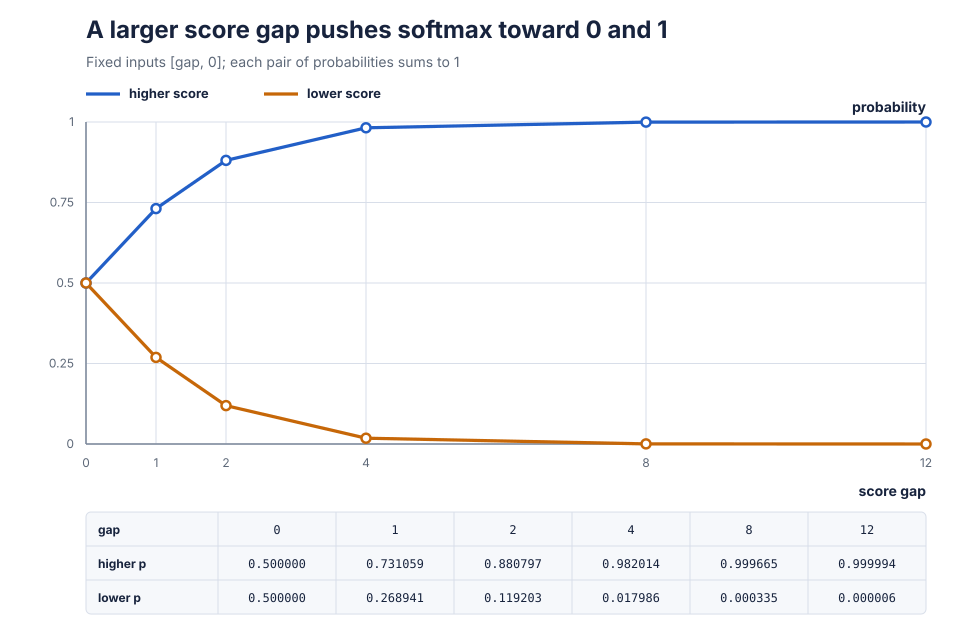
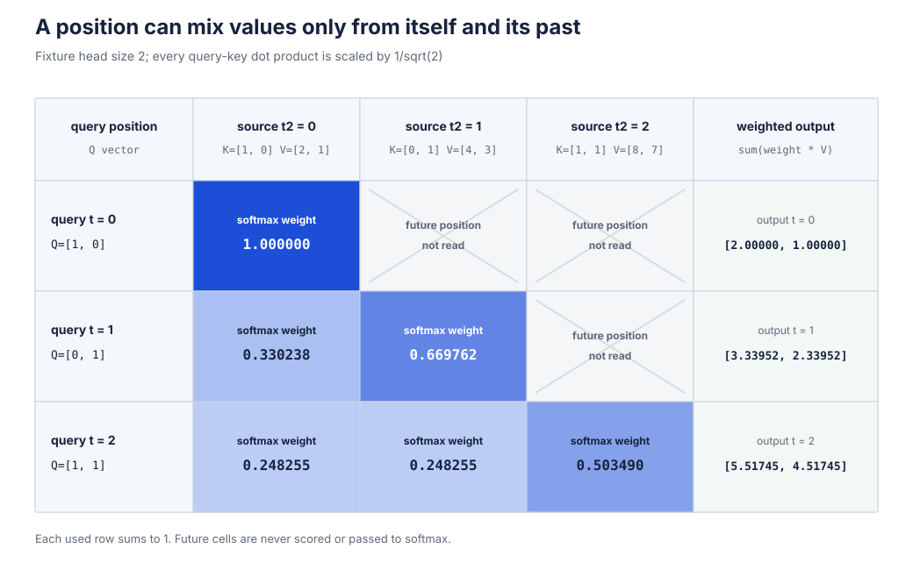
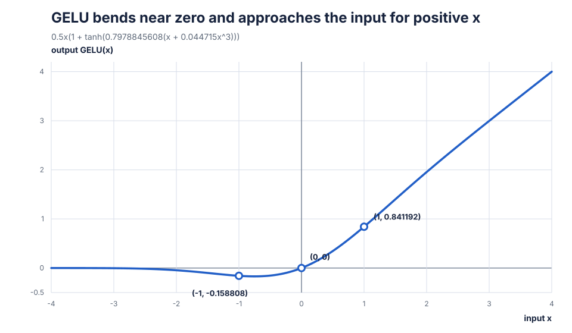

# Chapter 5: The Forward Pass

Chapter 0 showed a model turn token ids into predictions. Chapter 1
mapped the route, and Chapters 2 through 4 built the storage and data
that carry values along it. The arithmetic inside the route is still
missing.

Without that arithmetic, every token row remains isolated. There is no
way to combine its channels, consult earlier positions, or turn final
scores into one grade. This chapter builds each operation from numbers
small enough to check by hand. At the end, the model can make a
prediction and measure how far that prediction missed.

Chapter 1 [mapped this one-way
computation](01-the-map.md#one-trip-through-the-machine) and named it
the **forward pass**. During training, it starts with input token ids
and ends with output probabilities and a loss. With no targets,
`model_forward` stops after the logits; Chapter 16 will turn a final
logit row into a generated choice. Chapter 6 will walk the training
operations in reverse to learn from the loss.

The complete interfaces are in [`ops.h`](../src/ops.h), with their
implementations in [`ops.c`](../src/ops.c). Every C excerpt below is
from those files. An excerpt marked "shortened" omits surrounding
code; it never removes a line from inside a shown function.

## The two loops under the machine

Suppose one row contains three measurements:

```text
a = [ 2, -1,  3 ]
```

Another row gives each measurement a different importance:

```text
b = [ 4,  5, -2 ]
```

An ordered row of numbers is a **vector**. Each number keeps its
numbered position, so `[2, -1, 3]` differs from `[3, -1, 2]` even
though both contain the same three numbers.

Multiplying the first pair gives `2 * 4 = 8`, but that uses only one
channel. Repeat for matching positions, then add the three products:
Before reading the total line, predict the result.

```text
channel                 0       1       2
a                       2      -1       3
b                       4       5      -2
a times b               8      -5      -6

total = 8 + (-5) + (-6) = -3
```

The important detail is "matching positions": `a[0]` pairs with
`b[0]`, never with `b[1]`.

This multiply-matching-positions-then-add operation is a **dot
product**. For two rows with `C` channels, its compact mathematical
spelling is

```text
dot(a, b) = Σ from c = 0 through C - 1 of a[c] * b[c]
```

The capital Greek letter `Σ`, pronounced "sigma," is an instruction
to add repeated terms. Typeset math often puts the first index below
it and the last above it. This book writes both limits inline so they
remain readable in plain text. For the three-channel example, the
notation asks for

```text
a[0] * b[0] + a[1] * b[1] + a[2] * b[2]
```

This is **sum notation**. It shortens a loop after the loop is already
understood; it does not introduce new arithmetic.

The source writes that exact operation:

```c
static float dot(const float *a, const float *b, int count)
{
    float sum = 0.0f;

    for (int i = 0; i < count; i++)
        sum += a[i] * b[i];
    return sum;
}
```

`static` keeps this helper private to `ops.c`. The two `const`
pointers promise that the loop reads the input rows without changing
them. `sum` begins at zero. The `for` loop visits indices `0` through
`count - 1`, and `+=` replaces `sum` with its old value plus the next
product. The final line returns the accumulated number. If `count`
were zero, the loop would return zero, but every model call supplies a
positive channel count.

The second recurring job starts with an existing output. Take

```text
out    = [ 1,  2 ]
values = [ 4, -2 ]
scale  = 0.5
```

Assigning `scale * values` would produce `[2, -1]` and erase the
contribution already in `out`. The next contribution must be added,
not assigned. Predict the new second entry before reading the second
line:

```text
scaled values = [ 0.5 * 4, 0.5 * -2 ] = [ 2, -1 ]
new out       = [ 1 + 2,   2 + -1   ] = [ 3,  1 ]
```

The operation is a **scaled accumulation**. Numerical libraries often
call the same pattern **AXPY**, from "A times X plus Y." In this source,
the later row-mixing operation uses it to combine rows with different
shares. Backward operations use it to collect contributions that
arrive by several paths.

The source again says exactly that:

```c
static void add_scaled(float *out, float scale, const float *values, int count)
{
    for (int i = 0; i < count; i++)
        out[i] += scale * values[i];
}
```

This helper returns no separate value, which is what `void` means in
its declaration. It changes the array reached through `out`. The
`values` pointer is `const`, so that input is read-only. Each loop
iteration scales one input and accumulates it into one output.

Much of `src/ops.c` rests on these two tiny loops. Matrix
multiplication repeats the dot product. The later row-mixing operation
repeats both the dot product and the scaled accumulation. The larger
names in this chapter describe how those loops are arranged.

## Give each id a row of opening notes

The data loader gives the model integer token ids. An id such as `2`
has no channels to transform, and arithmetic on the number itself
would invent an ordering: id `4` is not twice as much language as id
`2`.

A table fixes the problem. Each token id chooses one learned row. A
second table contributes a learned row for the token's position.
Consider two sequences of length `T = 2`, flattened into one list by
Chapter 1's [batch-flattening
rule](01-the-map.md#stack-a-batch-into-rows):

```text
tokens = [ 2, 0, 1, 2 ]
           -----  -----
           seq 0  seq 1
```

Use these two-channel tables:

```text
first learned table         second learned table
row 0: [ 10, 20 ]           row 0: [ 0.1, 0.2 ]
row 1: [ 30, 40 ]           row 1: [ 1.0, 2.0 ]
row 2: [ 50, 60 ]
```

For each flattened row, choose the token row and add the position row:
Before reading the output column, predict row 2. Its flattened row
number is `2`, but it begins the second sequence, so its position must
restart at zero.

```text
row  token  position  token row    position row    output
 0     2        0     [50, 60]  +  [0.1, 0.2]  =  [50.1, 60.2]
 1     0        1     [10, 20]  +  [1.0, 2.0]  =  [11.0, 22.0]
 2     1        0     [30, 40]  +  [0.1, 0.2]  =  [30.1, 40.2]
 3     2        1     [50, 60]  +  [1.0, 2.0]  =  [51.0, 62.0]
```

Each output such as `[30.1, 40.2]` is a two-channel vector in the
language introduced at the start of this chapter. The `token_table`
parameter holds the first learned table; the second is the
**position table**. Choosing one vector from each and adding them
constructs an **embedding**: a token id now has a place in the model's
channel space. The token table supplies what the token is; the
position table supplies where this occurrence is.

The source computes position with `row % time`. The remainder operator
`%` produces `0, 1, ..., time - 1` and then repeats:

```text
row           0  1  2  3
row % time    0  1  0  1
```

Here is the full forward function:

```c
void embedding_forward(Mat out, const int *tokens, Mat token_table,
                       Mat position_table, int time)
{
    assert(out.cols == token_table.cols && out.cols == position_table.cols);

    for (int row = 0; row < out.rows; row++) {
        const float *token_vector    = mat_row(token_table, tokens[row]);
        const float *position_vector = mat_row(position_table, row % time);
        float       *output          = mat_row(out, row);

        for (int c = 0; c < out.cols; c++)
            output[c] = token_vector[c] + position_vector[c];
    }
}
```

The assertion requires all three matrices to have the same channel
count. The outer loop visits every flattened token row. The first
`mat_row` selects `tokens[row]` from the token table. The second uses
the repeating position. The third locates the output row. The inner
loop adds the two selected vectors one channel at a time.

The model's position table has `block_size` rows, not merely the
current `time` rows. This function accesses positions `0` through
`time - 1`. Its caller must therefore provide positive `time`, enough
position rows, valid token ids, and one token id for every output row.
The assertion checks channel agreement, not all of those conditions.

The function does not allocate memory or copy the ids for later. The
model keeps the batch's token ids alive because embedding backward
will need to know which table rows were chosen. The first recurring
forward rule has appeared: the model retains the values that the
reverse trip will need.

To check the indexing by hand, take `time = 3` and six output rows.
Which position row supplies output row 3? Since `3 % 3` is zero, the
answer must be position row 0. `labs/check05.c` tests that exact
sequence restart.

## Keep one row's scale from controlling the next operation

Two rows can carry the same pattern at very different sizes:

```text
small = [   1,   2,   3 ]
large = [ 100, 200, 300 ]
```

Compare each row with itself:

```text
dot(small, small) = 1*1 + 2*2 + 3*3 = 14
dot(large, large) = 100*100 + 200*200 + 300*300 = 140000
```

The second dot product is ten thousand times larger. Each side grew by
`100`, so each product grew by `100 * 100`. A later operation would
react mostly to size even though both rows have the same
low-middle-high pattern.

Chapter 2 built the [mean, variance, and standard
deviation](02-foundations.md#measure-a-sets-center-and-spread). Use
those tools within each row. Start with

```text
x = [ 1, 2, 3 ]
```

Before reading the calculation, predict the row's mean. The value `2`
sits in the middle, and the values on either side balance:

```text
mean = (1 + 2 + 3) / 3 = 2
```

Subtracting the mean centers the row:

```text
x - mean = [ -1, 0, 1 ]
```

Predict the population variance by squaring `[-1, 0, 1]`, adding, and
dividing by three:

```text
variance = ((-1)^2 + 0^2 + 1^2) / 3
         = (1 + 0 + 1) / 3
         = 2/3
```

Its standard deviation is `sqrt(2/3)`, about `0.8164966`. Dividing
the centered values by that number gives the first attempt:

```text
first attempt = [ -1.2247449, 0, 1.2247449 ]
```

A constant row breaks this rule:

```text
x = [ 7, 7, 7 ]
centered = [ 0, 0, 0 ]
variance = 0
```

Predict the denominator. It is `sqrt(0) = 0`, so the division is
invalid. Add a small positive value to the variance before the square
root:

```text
rstd = 1 / sqrt(variance + 0.00001)
```

The added `0.00001` is **epsilon**. `rstd` means reciprocal standard
deviation: the value by which the code multiplies instead of dividing
every channel. For the constant row, `rstd` is finite and all centered
values remain zero.

Apply the guarded rule to `[1, 2, 3]`:

```text
guarded standard deviation = sqrt(0.6666667 + 0.00001)
                           = about 0.8165027
rstd                       = about 1.2247357
normalized                 = about [ -1.2247357, 0, 1.2247357 ]
```

Predict the normalized row's mean. The negative and positive entries
cancel, giving zero. Its variance is approximately one.

The model still needs freedom to make one channel larger, reverse
another, or shift a channel. It therefore gives each channel a
learned `gain` and `bias`. With

```text
gain = [ 2.0, -1.0,  0.5 ]
bias = [ 0.25, 1.0, -2.0 ]
```

predict channel 1. Its normalized value is zero, so the gain cannot
change it and the bias makes the output `1`. The full calculation is

```text
channel 0:  2.0 * -1.2247357 + 0.25 = about -2.1994714
channel 1: -1.0 *  0.0000000 + 1.00 = exactly 1.0000000
channel 2:  0.5 *  1.2247357 - 2.00 = about -1.3876321
```

This row-by-row center, rescale, gain, and bias operation is **layer
normalization**, shortened to **layernorm** in the code. The
normalization step has approximately mean zero and variance one. The
final output need not: learned gain and bias deliberately change both.
For a constant row, every normalized value is zero, so the final
output is the bias vector.

Chapter 1 previewed layernorm as a [volume
knob](01-the-map.md#prepare-a-copy-preserve-the-highway).
Normalization brings
each row to a comparable level; gain and bias let training set each
channel's level again. Epsilon is a tiny floor under the spread
calculation, so a silent, constant row does not make the knob invalid.

The following shortened excerpt joins the file-level constant to the
complete function; the operations between them in `ops.c` are omitted:

```c
static const float LAYERNORM_EPSILON   = 1e-5f;       /* keeps 1/sqrt(var) finite */

void layernorm_forward(Mat out, float *means, float *rstds, Mat x,
                       const float *gain, const float *bias)
{
    assert(out.rows == x.rows && out.cols == x.cols);

    for (int row = 0; row < x.rows; row++) {
        const float *input  = mat_row(x, row);
        float       *output = mat_row(out, row);

        float mean = 0.0f;
        for (int c = 0; c < x.cols; c++)
            mean += input[c];
        mean /= (float)x.cols;

        float variance = 0.0f;
        for (int c = 0; c < x.cols; c++) {
            float centered = input[c] - mean;

            variance += centered * centered;
        }
        variance /= (float)x.cols;

        float rstd = 1.0f / sqrtf(variance + LAYERNORM_EPSILON);

        for (int c = 0; c < x.cols; c++)
            output[c] = gain[c] * ((input[c] - mean) * rstd) + bias[c];

        means[row] = mean;
        rstds[row] = rstd;
    }
}
```

`1e-5f` is C's compact spelling for the `float` value `0.00001`.
After the shape assertion, the outer loop treats each row separately.
The first channel loop adds the inputs, then division by `x.cols`
forms the mean. The second loop centers, squares, and adds; its final
division forms the population variance. `sqrtf` computes a `float`
square root. The third loop normalizes and applies gain and bias.
Finally, one mean and one reciprocal standard deviation are saved per
row.

Saving those two numbers is part of the operation, not an optional
optimization. The forward pass saves what the backward pass will need.
Chapter 6 will use the exact statistics that forward used. The caller
also keeps `x` and `gain` alive. This function checks matching input
and output shapes; its caller must supply a positive channel count and
arrays with one gain and bias per channel and one saved statistic per
row.

As a prediction check, use `[1, 2, 3]` with gain `[1, 1, 1]` and bias
`[0, 0, 0]`. Replacing the row with `[101, 102, 103]` should leave the
normalized output nearly unchanged. The mean moves by 100, then
centering removes that shared offset.

## Make every output from one input row

One input row with three channels is not enough when the next stage
needs two different mixtures. Reusing a single dot product would give
only one number. Give each desired output its own weight row:

```text
x = [ 1, 2, 3 ]

weight for output 0 = [ 1, 0, -1 ]
weight for output 1 = [ 2, 1,  0.5 ]
```

Predict both outputs before reading the calculations. Each output is a
dot product:

```text
output 0 = 1*1 + 2*0 + 3*(-1)   = -2
output 1 = 1*2 + 2*1 + 3*0.5    =  5.5
```

Now add a second input row:

```text
X = [  1  2  3 ]
    [ -1  0  2 ]

W = [ 1  0  -1  ]   one row per output
    [ 2  1   0.5 ]
```

Predict the lower-right output before revealing the result. The
second input row dotted with the second weight row is
`-1*2 + 0*1 + 2*0.5 = -1`.

```text
out = [ -2   5.5 ]
      [ -3  -1.0 ]
```

Repeating row-against-row dot products this way is **matrix
multiplication**. Chapter 1 built [matrix rows, columns, shapes, and
transpose](01-the-map.md#read-one-table-in-the-other-direction). If `X`
has shape `R x I` and the weight matrix has shape `O x I`, then the
output has shape `R x O`:

```text
out[r, o] = Σ from i = 0 through I - 1 of X[r, i] * W[o, i]
```

`I` is the input channel count and `O` is the output channel count.
The weight storage is `(output, input)`, one output's weights per row.
In the conventional matrix spelling, the operation is

```text
out = X * W^T
```

When the second matrix holds learned weights, this
multiply-by-a-weight-matrix step is a **linear transform**.

The raised `T` means transpose: view `W` with rows and columns
exchanged. The C loop does not create a transposed copy. Its stored
weight rows already put matching input weights next to each other, so
it can dot two contiguous rows.

A large matrix has many independent output rows, while one processor
may have several cores. A running program can follow more than one
path of instructions at the same time. The system schedules each path
separately, but the paths share the program's memory. Each such path
is a **thread**. Assigning different rows to worker threads lets those
cores do useful work at the same time. Threading is safe here because
one outer iteration writes one complete output row. No other
iteration writes that row. Contrast that with this unsafe arrangement:

```text
thread 0 reads total = 5, plans to add 2
thread 1 reads total = 5, plans to add 3
thread 0 writes 7
thread 1 writes 8
```

The intended result was 10, but one update disappeared. Two threads
accessing the same location at overlapping times without
synchronization, with at least one write, form a **data race**. In C,
a data race gives undefined behavior: the language promises no
particular result.
`matmul_forward` avoids one because its threads write disjoint rows.
This loop independence is about memory locations; it is different
from the [probabilistic
independence](02-foundations.md#measure-a-sets-center-and-spread)
Chapter 2 used when adding variances.

The compiler and runtime feature that assigns eligible loop iterations
to threads is **OpenMP**. The `#pragma omp` line is its compiler
directive. `parallel for` may divide outer-loop iterations among a
thread team. The `if` clause uses threads only when there are at least
64 output rows:

```c
enum { PARALLEL_THRESHOLD = 64 };
```

Here is the complete implementation:

```c
void matmul_forward(Mat out, Mat x, Mat weights)
{
    assert(x.cols == weights.cols && out.cols == weights.rows && out.rows == x.rows);

    #pragma omp parallel for if(out.rows >= PARALLEL_THRESHOLD)
    for (int row = 0; row < out.rows; row++) {
        const float *input  = mat_row(x, row);
        float       *output = mat_row(out, row);

        for (int o = 0; o < weights.rows; o++)
            output[o] = dot(input, mat_row(weights, o), weights.cols);
    }
}
```

The assertion states all three shape requirements. The OpenMP
directive on the next line applies the threshold rule built above.
The outer loop selects one input and output row. Its two `mat_row`
calls locate those rows. The inner loop selects each weight row, takes
its dot product with the input, and assigns the result to one output
channel.

Assignment matters here: forward creates each output instead of
adding into an old value. There is no bias in this function.
Operations that need a bias handle it separately.

Starting and joining a thread team costs work, so small matrices stay
serial. With `OPENMP=0`, the build has no OpenMP support and the loop
runs normally on one thread.

For the same executable and floating-point environment, changing the
thread count does not change the order of arithmetic within any
output dot product. That gives the same result per output. It is not a
promise that different compilers or floating-point settings round
every expression identically.

The same `(output, input)` weight layout serves every call. [Chapter
9](09-parameters-and-the-blueprint.md) constructs the **tied head**:
the final prediction head reuses the token table as its weights. No
special multiplication routine is needed there.

## Turn arbitrary scores into usable shares

The row-mixing operation in the next section will produce scores such
as

```text
scores = [ 2, 1, 0 ]
```

They cannot yet say how much of each row to mix. Dividing by their sum
would give `[2/3, 1/3, 0]` here, but it breaks on
`[2, 0, -1]`: one share becomes negative. A second problem appears if
every score receives the same offset. `[2, 1, 0]` and
`[102, 101, 100]` express the same ordering and gaps, yet division by
the raw sum gives very different shares.

Chapter 2 built [exponential growth and its
undo](02-foundations.md#growth-and-its-undo). `exp(x)` is always
positive, and a shared offset multiplies every exponential by the same
positive factor. Apply it to each score, then divide each result by
their total. Before reading the table, predict which share is largest
and what the three shares should add to:

```text
score                  2         1         0
exp(score)          7.3891    2.7183    1.0000
total              11.1074
share               0.6652    0.2447    0.0900
```

All shares are nonnegative and they add to one, apart from the shown
rounding. A set of nonnegative values that sums to one is a
**probability distribution**. Each value is the probability assigned
to one choice.

The complete score-to-distribution operation is **softmax**:

```text
softmax(score[i]) = exp(score[i]) / Σ exp(score[j])
```

The sum in the denominator visits every choice `j`. It couples the
outputs: raising one score increases its own share and also changes
the common total used by every other share.

A shared offset cancels. If every score gains `k`, Chapter 2's
`exp(a + b) = exp(a) * exp(b)` rule gives

```text
exp(score[i] + k)         exp(score[i]) * exp(k)
---------------------- = -------------------------
Σ exp(score[j] + k)       Σ exp(score[j]) * exp(k)

                       = exp(score[i]) / Σ exp(score[j])
```

The common `exp(k)` appears above and below the division, so removing
it changes nothing mathematically. Choose `k` as the negative of the
largest score. Then the largest shifted score is zero and its
exponential is one. Every other shifted score is at most zero, so its
exponential is at most one.

For `[2, 1, 0]`, subtracting the maximum gives a hand-checkable route
to the same answer:

```text
shifted score        0        -1        -2
exp(shifted)      1.0000    0.3679    0.1353
sum              1.5032
probability       0.6652    0.2447    0.0900
```

Now predict the relationship between the first two probabilities for
`[1000, 1000, 999]`. Equal scores must receive equal probabilities.
Subtracting 1000 avoids attempting to represent `exp(1000)`:

```text
shifted score        0          0         -1
exp(shifted)      1.000000   1.000000   0.367879
probability       0.422319   0.422319   0.155362
```

The full helper and its public wrapper are:

```c
static void softmax_with_details(float *values, int count,
                                 float *maximum_out, float *sum_out)
{
    assert(count >= 1);

    float max = values[0];

    for (int i = 1; i < count; i++)
        if (values[i] > max)
            max = values[i];

    /* For finite inputs, subtracting the max changes nothing
     * mathematically and keeps every exponential at most 1.  Terms
     * below float range become zero in the returned distribution. */
    float total = 0.0f;

    for (int i = 0; i < count; i++) {
        values[i] = expf(values[i] - max);
        total += values[i];
    }
    for (int i = 0; i < count; i++)
        values[i] /= total;
    if (maximum_out != NULL)
        *maximum_out = max;
    if (sum_out != NULL)
        *sum_out = total;
}

void softmax_in_place(float *values, int count)
{
    softmax_with_details(values, count, NULL, NULL);
}
```

The assertion makes `values[0]` safe to read. The first loop finds the
maximum. The next loop replaces every score with its shifted
exponential and accumulates their total. The following loop divides
in place, so the caller's score array becomes a distribution.

The two pointer outputs are optional. When either is not `NULL`, the
helper stores the maximum or exponential sum there. The row-mixing
call does not need those details, so `softmax_in_place` passes `NULL`
for both. The final grading operation will use them later.

Maximum subtraction protects ordinary finite inputs from exponential
overflow. IEEE floating point also has markers outside those finite
numbers. A positive result too large for `float` can become positive
infinity; the corresponding marker exists in the negative direction.
An operation with no real-number answer, such as
`infinity - infinity`, produces `NaN`, short for "not a number."
Together, infinities and `NaN` are **nonfinite floating-point
values**.

Nonfinite inputs are outside this function's guarantee. With a
positive-infinity maximum, the shift asks for
`infinity - infinity`; an all-negative-infinity row asks for the same
subtraction. Both produce `NaN`, not a usable distribution. An
isolated negative infinity under a finite maximum does map to zero. A
very negative finite shifted score can also have an exponential too
small for `float`, in which case it becomes zero. The maximum term
remains `expf(0) = 1`, so the denominator stays positive for finite
input.

Large score gaps concentrate almost all probability on one choice:

```text
scores          [ 10,          0,             -10 ]
probability     [ 0.9999546,   0.0000454, about 0.000000002 ]
```

This near-one-versus-near-zero behavior is **softmax saturation**.
The curve below fixes the other score at zero and varies the first
score. Near a gap of zero, both choices can move appreciably. Far from
zero, the larger choice is already near one.



Source: deterministic values from
[`scripts/figures/05_softmax_saturation.py`](../scripts/figures/05_softmax_saturation.py).

Before moving on, predict `softmax([5, 5, 5])`. All inputs are equal,
so all outputs must be equal; three equal nonnegative values that sum
to one are `[1/3, 1/3, 1/3]`.

## Let one position consult the visible past

Embedding, layernorm, and matrix multiplication process one flattened
row without reading another. If those were the only operations, the
row for `t = 4` could not inspect what happened at `t = 3`. Each
position would carry only its own notes through the model.

To let rows meet, give every position three pieces of information:

```text
search row       what this position wants to find
advertising row  what this position can be found by
carried row      what this position contributes if selected
```

For a two-position, two-channel example, use

```text
position    search     advertising    carried
   0        [1, 0]       [1, 0]       [2, 1]
   1        [0, 1]       [0, 1]       [4, 3]
```

At position 0, only position 0 is visible. Its search row dotted with
that advertising row is `1`. A one-element softmax always gives the
sole choice probability `1`, so the output is the carried row
`[2, 1]`.

At position 1, compare its search row `[0, 1]` with both visible
advertising rows:

```text
against row 0: 0*1 + 1*0 = 0
against row 1: 0*0 + 1*1 = 1
```

There is one adjustment before softmax. With many channels, a dot
product adds many terms. Chapter 2 showed that the variances of
[independent, centered
contributions](02-foundations.md#measure-a-sets-center-and-spread)
add. For a concrete model, imagine each search and advertising channel
independently takes `-1` or `1` with equal chance. Each matching
product is also `-1` or `1`, with mean zero and variance one.

With `D` channels, the dot product adds `D` such contributions:

```text
variance of sum          = D
standard deviation       = sqrt(D)
```

Its typical size grows with `sqrt(D)`. Divide by that same number to
keep the score scale near one:

```text
score = dot(search, advertising) / sqrt(D)
```

This argument describes the initialization-scale model, where the
terms are independent and have unit variance. After training, real
search and advertising channels need not remain independent or keep
that spread. The division still removes the built-in growth caused
solely by the number of channels.

In the hand example, `D = 2`, so the divisor is `sqrt(2)` and the
multiplier is `1/sqrt(2)`, about `0.7071068`:

```text
position 1 raw dot products       [ 0,        1        ]
after multiplying by 0.7071068    [ 0,        0.7071068 ]
softmax probabilities             [ 0.330238, 0.669762  ]
```

Predict which carried row contributes more before reading the last
row. The second advertising row matched the search row better, so its
carried row receives the larger share.

Multiply each carried row by its probability and add:

```text
output channel 0
    = 0.330238*2 + 0.669762*4
    = 0.660476   + 2.679048
    = 3.339524

output channel 1
    = 0.330238*1 + 0.669762*3
    = 0.330238   + 2.009286
    = 2.339524
```

The three rows now have their formal names. The search row is a
**query**, the advertising row is a **key**, and the carried row is a
**value**. The names follow a lookup table: compare a query with keys,
then retrieve a mixture of the corresponding values. In the model, a
matrix multiplication produces all three from the same input row.

An average uses equal shares. This operation allows unequal
nonnegative shares that still sum to one, so it is a **weighted
average**. The probabilities used in that average are **attention
weights**. The score formula is a **scaled dot product**.

This row-mixing mechanism is the only place in this chapter where
token rows meet. It must preserve
[Chapter 1's no-peeking rule](01-the-map.md#no-peeking-at-the-answer):
a row at position `t` may consult positions `0` through `t`, never a
later position. The source enforces that rule by computing no future
score.

```text
query position       visible key positions
      0                      0
      1                      0 1
      2                      0 1 2
```

The complete construction is **attention**. More fully, this version
is **causal scaled dot-product attention**:

```text
query and visible keys  -> scaled dot products
scaled visible scores   -> softmax attention weights
weights, visible values -> weighted average
```

The allowed score cells form a lower-left triangle. Pale crossed cells
in the figure are future positions that the source never writes or
reads.



Source: deterministic calculations from the `check05.c` fixture in
[`scripts/figures/05_causal_attention.py`](../scripts/figures/05_causal_attention.py).

### Split the channels into separate heads

One set of attention weights would force all `C` output channels to
mix the same positions in the same proportions. Split the channels
into `H` groups instead. Each group computes its own scores and
weighted average.

For `C = 4` and `H = 2`, each group has

```text
D = C / H = 4 / 2 = 2 channels
```

Each group is an attention **head**, and `D` is the **head size**. The
query, key, and value rows are packed side by side. Inside each
`C`-wide part, the two heads also sit side by side:

```text
one packed row, C = 4, H = 2, D = 2

+-------------------+-------------------+-------------------+
| query: h0 | h1    | key: h0 | h1      | value: h0 | h1    |
+-------------------+-------------------+-------------------+
```

The full row has `3C` columns. `ops.h` assigns integer names to the
three parts:

```c
/* qkv matrices pack three projections side by side per row: [q | k | v]. */
enum { QUERIES, KEYS, VALUES, QKV_STREAMS };
```

In a C `enum`, names without explicit values receive consecutive
integers. `QUERIES`, `KEYS`, and `VALUES` are `0`, `1`, and `2`;
`QKV_STREAMS` is `3`. That final name serves as the number of packed
parts.

The helper that locates one head-sized slice is:

```c
static const float *qkv_slice(Mat qkv, int row, int stream, int offset)
{
    return mat_row(qkv, row) + stream * (qkv.cols / QKV_STREAMS) + offset;
}
```

`mat_row` reaches the start of the packed row. Dividing its width by
three recovers `C`. Multiplying by `stream` skips zero, one, or two
complete `C`-wide parts. Adding `offset`, which is `head * head_size`,
then reaches the requested head inside that part. This is [pointer
arithmetic](04-poor-mans-tensors.md#turn-two-coordinates-into-one-offset)
of the form Chapter 4 used: adding `n` to a `float *` advances by `n`
float elements.

Two heads can now mix different value slices. A small check sets every
query and key to zero, so each visible position gets an equal
attention weight:

```text
position    head 0 value    head 1 value
   0          [1, 2]          [10, 20]
   1          [3, 4]          [30, 40]
```

At position 1, both heads average their two visible values. Predict
the four output channels:

```text
head 0 output = 0.5*[1, 2]   + 0.5*[3, 4]   = [2, 3]
head 1 output = 0.5*[10, 20] + 0.5*[30, 40] = [20, 30]
full output                                            [2, 3, 20, 30]
```

No head can read another head's value slice. Their outputs are placed
side by side to restore the full `C` channels. Computing this mechanism
for every head, with queries, keys, and values derived from the same
sequence of rows, gives **causal multi-head self-attention**.

### Walk the attention code

The score workspace has one row for every sequence, head, and query
position:

```text
scores shape = (B * H * T) x T = (R * H) x T

score row for (seq, head, t)
    = (seq * H + head) * T + t
```

Only columns `0` through `t` of that row contain attention weights.
Columns after `t` remain untouched and have no meaning. Code outside
the operation must not inspect them.

Here is the complete helper for one sequence and one head:

```c
static void attention_head_forward(Mat out, Mat scores, Mat qkv, int seq,
                                   int head, int time, int head_count)
{
    int   head_size = out.cols / head_count;
    int   offset    = head * head_size;
    float scale     = 1.0f / sqrtf((float)head_size);

    for (int t = 0; t < time; t++) {
        const float *query   = qkv_slice(qkv, seq * time + t, QUERIES, offset);
        float       *weights = mat_row(scores, (seq * head_count + head) * time + t);

        /* Causality is a loop bound: position t sees 0..t only. */
        for (int t2 = 0; t2 <= t; t2++)
            weights[t2] = scale * dot(query, qkv_slice(qkv, seq * time + t2, KEYS, offset), head_size);
        softmax_in_place(weights, t + 1);

        float *output = mat_row(out, seq * time + t) + offset;

        memset(output, 0, (size_t)head_size * sizeof *output);
        for (int t2 = 0; t2 <= t; t2++)
            add_scaled(output, weights[t2], qkv_slice(qkv, seq * time + t2, VALUES, offset), head_size);
    }
}
```

The first three lines derive `D`, the head's channel offset, and the
scale. The `t` loop visits each query position. Its first pointer finds
that query slice. Its second pointer finds the score row for this
sequence, head, and position.

The `t2 <= t` loop is the causal boundary. It dots the current query
with each visible key, scales the result, and writes only the visible
prefix. Softmax receives `t + 1`, exactly the length of that prefix.

The output pointer selects the current flattened row and advances to
this head's slice. The next loop uses `+=` inside `add_scaled`, so old
bytes in that output slice would leak into the weighted average. Every
element must begin at zero.

`memset` comes from `<string.h>`. It fills a number of bytes with one
repeated byte value; this operation is a **byte fill**. Here the byte
value is zero. The third argument is a byte count: `head_size`
elements times the size of one output element. On the supported IEEE
floating-point platforms, all-zero bytes represent `+0.0f`. This
source relies on that platform property.

For every visible position, the final loop scales the value slice by
the corresponding attention weight and accumulates it into the
zeroed output. Those two lines are the weighted average calculated by
hand above.

The public wrapper checks the packed shapes and assigns independent
sequence-head pairs:

```c
void attention_forward(Mat out, Mat scores, Mat qkv, int time, int head_count)
{
    int sequence_count = out.rows / time;

    assert(qkv.cols == QKV_STREAMS * out.cols && out.cols % head_count == 0);
    assert(scores.cols == time && out.rows % time == 0);

    #pragma omp parallel for collapse(2) if(sequence_count * head_count >= PARALLEL_THRESHOLD)
    for (int seq = 0; seq < sequence_count; seq++)
        for (int head = 0; head < head_count; head++)
            attention_head_forward(out, scores, qkv, seq, head, time, head_count);
}
```

`sequence_count` reverses the flattening rule `R = B*T`. The first
assertion requires a `3C` packed input and an equal head split. The
second requires `T` score columns and complete sequences.
`collapse(2)` lets OpenMP treat each `(seq, head)` pair as one unit of
work. Those pairs write disjoint score rows and disjoint output channel
slices, so they do not race.

The caller must pass positive `time` and `head_count` before this
function divides or takes a remainder by them. It must also provide
the full row capacities implied by the shapes. The assertions catch
the main shape disagreements, not every invalid pointer or capacity.

Sequence indexing uses `seq * time + t`, so a position in one sequence
never consults keys or values from another. For a direct causality
check, change every query, key, and value at position 2. Outputs at
positions 0 and 1 must remain bit-for-bit unchanged because neither
earlier loop ever visits `t2 = 2`.

## Add an edit without erasing the notes

An attention block produces an edit to the current row. Replacing the
row with that edit would force every later block to reconstruct any
earlier information it still needed. Keep both by adding the edit to
the incoming notes.

For

```text
incoming row = [ 1, -2, 4.5 ]
block edit   = [ 3,  5, 0.5 ]
```

predict the middle output. Elementwise addition gives

```text
output = [ 1+3, -2+5, 4.5+0.5 ] = [ 4, 3, 5 ]
```

The incoming row can now continue unchanged in any channel where the
block emits zero. This add-around-a-block route is a **residual
connection**. The sequence of rows carried along that route is the
**residual stream**, previewed in Chapter 1 as the model's
[highway](01-the-map.md#zone-3-repeated-editing-blocks).
Each block reads the highway, computes an edit, and merges the edit
back by addition.

The full forward function is:

```c
void residual_forward(Mat out, Mat a, Mat b)
{
    size_t count = mat_size(out);

    for (size_t i = 0; i < count; i++)
        out.vals[i] = a.vals[i] + b.vals[i];
}
```

`mat_size(out)` returns `rows * cols`, so one flat loop covers every
element. Each iteration reads matching elements from `a` and `b` and
assigns their sum. The function contains no shape assertion; its
caller must provide buffers with the same element count.

Using exactly the same buffer for `out` and one input works for this
loop: if `out.vals` is the same address as `a.vals`, each iteration
reads `a[i]` before writing `out[i]`. The model uses distinct
matrices. A shifted overlap is different. If `out.vals` begins at
`a.vals + 1`, writing `out[0]` changes `a[1]` before the next
iteration reads it. The interface promises no result for such
partially overlapping regions.

Chapter 6 will show the second benefit of the highway during the
reverse pass. For now, its forward contract is only elementwise
addition. Changing `b` to all zeros must leave `a` unchanged at the
output.

## Put a bend between widen and narrow

Two matrix multiplications in a row appear to add depth:

```text
x --multiply by 2--> 2x --multiply by 3--> 6x
```

But the same result needs only one multiplication by 6. With matrices,
the arithmetic is larger but the collapse remains: two fixed linear
mixtures with no operation between them can be combined into one
fixed linear mixture. Stacking more of them does not let the response
bend.

One part of the transformer first widens a row from `C` channels to
`4C`, then narrows it back to `C`. It needs an operation between those
multiplications whose response bends instead of following a straight
line.

Start by building a useful S-shaped factor from Chapter 2's
exponential:

```text
             exp(2u) - 1
factor(u) = ---------------
             exp(2u) + 1
```

At three small inputs:

```text
u = -1: (exp(-2) - 1) / (exp(-2) + 1) = -0.7616
u =  0: (exp( 0) - 1) / (exp( 0) + 1) =  0
u =  1: (exp( 2) - 1) / (exp( 2) + 1) =  0.7616
```

The factor stays between `-1` and `1`, crosses zero at zero, and bends
toward its limits. It is the **hyperbolic tangent**, written
`tanh(u)`. The C math library provides `tanhf` for a `float`; the
source does not evaluate the exponential fraction itself.

Chapter 2 built the [zero-mean, unit-spread Gaussian
bell](02-foundations.md#turn-two-flat-draws-into-a-bell). At any input
`x`, the share of that bell at or below `x` moves from near zero on the
far left to near one on the far right. Multiplying `x` by that share
would make the needed bend. Computing the bell's accumulated area
directly would require another operation, so this source uses a tanh
formula fitted to the same curve.

The first fixed constant, `0.7978845608`, is `sqrt(2/pi)`. The second,
`0.044715`, controls a small cubic correction that makes the tanh curve
track the Gaussian share more closely. It is a fixed approximation
coefficient, not a learned parameter. Use those constants to construct
the bend:

```text
inner = 0.7978845608 * (x + 0.044715*x*x*x)
out   = 0.5*x*(1 + tanh(inner))
```

For `x = -1`, the inner value is about `-0.8336` and `tanh(inner)` is
about `-0.6824`:

```text
out = 0.5*(-1)*(1 - 0.6824) = -0.1588
```

Predict the output at zero. The outer multiplication by `x` makes it
exactly zero. At `x = 1`, symmetry gives

```text
out = 0.5*(1)*(1 + 0.6824) = 0.8412
```

An operation with a bent response of this kind is a
**nonlinearity**. This particular bend is the **Gaussian Error Linear
Unit**, abbreviated **GELU**. "Gaussian" refers to the bell-shaped
share that the tanh formula approximates. The original paper is listed
under [GELU in Appendix B](appendix-b-sources.md#gelu). The
implementation uses the displayed approximation. The following
shortened excerpt joins the file-level constants to the complete
function; intervening operations are omitted:

```c
static const float GELU_SQRT_2_OVER_PI = 0.7978845608f;
static const float GELU_CUBIC_COEFF    = 0.044715f;

void gelu_forward(Mat out, Mat x)
{
    size_t count = mat_size(x);

    for (size_t i = 0; i < count; i++) {
        float value = x.vals[i];
        float inner = GELU_SQRT_2_OVER_PI * (value + GELU_CUBIC_COEFF * value * value * value);

        out.vals[i] = 0.5f * value * (1.0f + tanhf(inner));
    }
}
```

The two constants name the fixed numbers in the formula. `count`
flattens the input matrix because each element is transformed without
consulting any neighbor. Inside the loop, `value` saves the current
input, `inner` computes the cubic expression, and the final line
stores the transformed value.

The operation does not assert that `out` matches `x`; the caller must
supply at least `mat_size(x)` output elements. The model also keeps
the input values for the reverse operation in Chapter 6.

Large positive inputs have `tanh(inner)` near `1`, so GELU approaches
the input. Large negative inputs have `tanh(inner)` near `-1`, so GELU
approaches zero from below. Around zero it changes gradually. The
figure shows the region where the bend matters and marks the three
lab values.



Source: the constants and deterministic formula in
[`scripts/figures/05_gelu.py`](../scripts/figures/05_gelu.py).

A one-channel widen-bend-narrow example shows why the bend cannot
collapse. Let the widening weights be four rows:

```text
up weights = [  1 ]
             [ -1 ]
             [  0 ]
             [  0 ]
```

For input `x = 1`, matrix multiplication produces
`[1, -1, 0, 0]`. GELU changes that to approximately
`[0.8412, -0.1588, 0, 0]`. Narrow with one weight row:

```text
down weights = [ 1, 1, 0, 0 ]

output = 1*0.8412 + 1*(-0.1588) = 0.6824
```

A single multiplier could match that one input, so test the other side
before deciding whether the bend matters. Predict the result for
`x = -1`. The widened values swap:

```text
up output   = [ -1, 1, 0, 0 ]
after GELU  = about [ -0.1588, 0.8412, 0, 0 ]
down output = -0.1588 + 0.8412 = 0.6824
```

Any single multiplication with output `0.6824` at `x = 1` must output
`-0.6824` at `x = -1`. This pair outputs positive `0.6824` at both, so
it cannot collapse to one multiplication. Without GELU, the up and
down weights give zero at both inputs.

This widen, bend, then narrow unit is a **multi-layer perceptron**,
abbreviated **MLP**. It is also called the model's **feed-forward
block**. Here its three operations are a widening matrix
multiplication, GELU, and a narrowing matrix multiplication.

For the full model, the same pattern is

```text
R x C  ->  R x 4C  ->  R x 4C  ->  R x C
input      up matmul     GELU       down matmul
```

There is no `mlp_forward` function in `ops.c`. Chapter 11 will wire
the two calls to `matmul_forward` and the call to `gelu_forward` into
the model's feed-forward block.

## Grade one next-token bet

After the final model block, one more matrix multiplication produces
one score per vocabulary entry. For a three-token vocabulary, one row
might be

```text
[ 2, 0, -1 ]
```

These are raw preference scores. They may be negative, and they need
not sum to one. Such scores at the model's output are **logits**.
Predict which entry will receive the largest probability. Softmax
preserves the ordering while making every entry nonnegative. It turns
the logits into approximately

```text
[ 0.843795, 0.114195, 0.042010 ]
```

Chapter 3 constructed each target as the
[next token](03-data.md#one-extra-token-supplies-every-answer). If
the target id is `0`, the model assigned the correct continuation
probability `0.843795`. If the target is `2`, it assigned only
`0.042010`.

A grade must reward probability near one and penalize probability near
zero. A first attempt is `1 - p`:

```text
target probability p       1 - p
        1.00                 0.00
        0.50                 0.50
        0.25                 0.75
```

The first halving adds `0.50` to that penalty; the second adds only
`0.25`. The same multiplicative mistake matters less as probability
falls. A useful grade should charge the same added amount whenever the
model halves the probability of the right answer.

Chapter 2's [natural
logarithm](02-foundations.md#growth-and-its-undo) supplies that
behavior because it turns multiplication into addition:

```text
log(p/2) = log(p * 1/2)
         = log(p) + log(1/2)
         = log(p) - log(2)
-log(p/2) = -log(p) + log(2)
```

Every halving therefore adds the same `log(2)`, about `0.6931`. The
negative sign makes the penalty nonnegative for `0 < p <= 1`:

```text
target probability p       -log(p)
        1.00                 0.0000
        0.50                 0.6931
        0.25                 1.3863
```

Predict the penalty at `p = 0.125`. This is one more halving, so the
answer is about `2.0794`. Confidently assigning a tiny probability to
the target now costs much more than assigning it a large probability.

The same `0.125` can come from multiplying two assigned target
probabilities:

```text
0.50 * 0.25 = 0.125
-log(0.125) = about 2.0794
-log(0.50) + -log(0.25) = 0.6931 + 1.3863 = 2.0794
```

Multiplication of the probabilities has become addition of the row
penalties. That makes averaging many row penalties possible without
multiplying a long chain of tiny numbers.

Now grade two rows:

```text
row  logits          probabilities                    target
 0   [ 2, 0, -1 ]    [ 0.843795, 0.114195, 0.042010 ]    0
 1   [-1, 0,  2 ]    [ 0.042010, 0.114195, 0.843795 ]    1
```

The displayed probabilities are rounded to six decimals. Predict
which row receives the larger penalty, then use the unrounded softmax
values:

```text
row 0 penalty = about 0.169846
row 1 penalty = about 2.169846

mean penalty = (0.169846 + 2.169846) / 2
             = about 1.169846
```

Now change only the targets to `[2, 2]`. Predict whether the mean will
rise or fall before reading the calculation. Row 0 now selects its
smallest probability:

```text
row 0 penalty = about 3.169846
row 1 penalty = about 0.169846

mean penalty = (3.169846 + 0.169846) / 2
             = about 1.669846
```

The logits and probabilities did not move. The grade moved because the
answer key did.

## Cross-entropy: keeping score

The mean negative log probability assigned to the requested targets is
**cross-entropy**. Its returned scalar is the model's **loss**: one
number that measures this batch of next-token bets. Lower is better,
with zero approached when every target receives probability one.

A direct implementation could compute softmax and then call
`-log(prob[target])`. That fails for an extreme but finite row:

```text
logits = [ 1000, 0 ]
target = 1
```

After stable softmax, `exp(-1000)` is too small for `float` and the
stored target probability becomes zero. `log(0)` is not finite, even
though the logits describe a meaningful penalty of about 1000.

The maximum and exponential sum already computed by softmax provide a
stable route. Let

```text
m = maximum logit
S = Σ exp(logit[j] - m)
```

For target `t`, the stored probability is

```text
p[t] = exp(logit[t] - m) / S
```

Chapter 2's [growth and undo](02-foundations.md#growth-and-its-undo)
showed that `log(exp(a)) = a` and
`log(a*b) = log(a) + log(b)`, the logarithm's product identity. Its
quotient identity follows from the same equation. If `q = a/b`, then
`q*b = a`, so

```text
log(q) + log(b) = log(a)
log(q)          = log(a) - log(b)
log(a/b)        = log(a) - log(b)
```

Apply that result one line at a time:

```text
-log(p[t])

= -log(exp(logit[t] - m) / S)

= -(log(exp(logit[t] - m)) - log(S))

= -((logit[t] - m) - log(S))

= log(S) + m - logit[t]
```

The first two terms recover the logarithm of all unshifted
exponentials without ever forming their possibly huge sum:

```text
log-sum-exp(logits) = m + log(Σ exp(logit[j] - m))
target penalty      = log-sum-exp(logits) - logit[t]
```

The first line is the **log-sum-exp** operation. For `[1000, 0]`,
predict `S` after maximum subtraction. It rounds to `1`, so
log-sum-exp is `1000 + log(1) = 1000`. Subtracting target logit zero
leaves a penalty of `1000`. This route never takes the logarithm of
the stored zero probability.

Here is the complete implementation:

```c
float crossentropy_forward(Mat probs, Mat logits, const int *targets)
{
    double total_loss = 0.0;   /* accumulate in double: many small terms */

    assert(probs.rows == logits.rows && probs.cols == logits.cols);

    for (int row = 0; row < logits.rows; row++) {
        float *prob = mat_row(probs, row);
        int    target = targets[row];
        float  maximum;
        float  exponential_sum;

        assert(target >= 0 && target < logits.cols);
        memcpy(prob, mat_row(logits, row), (size_t)logits.cols * sizeof *prob);
        softmax_with_details(prob, logits.cols, &maximum, &exponential_sum);

        /* This log-sum-exp form stays finite when the target probability
         * itself underflows in the float distribution above. */
        total_loss += log((double)exponential_sum)
                    + (double)maximum
                    - (double)mat_row(logits, row)[target];
    }
    return (float)(total_loss / logits.rows);
}
```

The accumulator is `double`, which carries more precision and range
than `float` while many row penalties are added. The shape assertion
requires a probability cell for every logit. Each loop reads its
target and checks that the id selects a valid column.

`memcpy` copies the bytes of the logit row into a distinct probability
row. Unlike `memset`, which repeats one byte value, it preserves every
source byte. Softmax then changes the copy in place while retaining
the original logits for the stable formula. Passing addresses for
`maximum` and `exponential_sum` asks the helper to return both details.

The `log` call takes a `double`, and each other term is converted to
`double` before the arithmetic. The final division forms the mean
across rows, then the return converts it to `float`. Stable
log-sum-exp prevents the common underflow failure; it does not make
arbitrary invalid inputs safe. The caller must provide distinct
`probs` and `logits` storage, at least one row and one column, finite
logits, and one target per row. An extraordinarily large finite
penalty can also exceed `float` range during the final conversion.

If every one of the model's `V = 80` vocabulary entries has equal
probability, each target probability is `1/80`. The mathematical loss
is predictable from the rule above. Compute `-log(1/80)` before
reading the last value:

```text
-log(1/80) = log(80) = 4.3820266
```

The [recorded training run](logs/train-cyberpunk-5000.log) begins at
loss `4.4395`, as also recorded in
[`EVIDENCE.md`](../EVIDENCE.md). Random initial logits on that first
batch are not exactly uniform, so the two numbers need not match.
A sustained loss decrease means the model is moving probability
toward the corpus continuations, although individual batch values can
move up or down.

With the default `B = 32` and `T = 128`, one training step grades

```text
R = B*T = 32*128 = 4096 next-token rows
```

The mean keeps the loss scale from growing merely because a batch has
more rows.

## The forward contract, now earned

Every operation has now been built from its failure case and its
numbers. The table can summarize the interfaces without hiding the
mechanism. `R = B*T`, `C` is the residual width, `I` and `O` are input
and output widths, `H` is the head count, and `V` is the vocabulary
size.

| Operation | Inputs | Output | Kept for the reverse pass |
|---|---|---|---|
| embedding | ids, token `V x C`, position `block_size x C`, `T` | `R x C` | token ids and `T` |
| layernorm | `R x C`, gain, bias | `R x C` | input, gain, row means, row reciprocal standard deviations |
| matmul | `R x I`, weights `O x I` | `R x O` | input and weights |
| softmax | one finite score row | same row as probabilities | nothing by the helper alone |
| attention | packed QKV `R x 3C`, `T`, `H` | `R x C` and score workspace | QKV and each written weight prefix |
| GELU | any matrix | same shape | input |
| residual | two equal-size matrices | same size | no private value |
| cross-entropy | logits `R x V`, `R` targets | probabilities and one mean loss | probabilities and targets |

"Kept" does not always mean copied. Model-owned inputs can remain in
their existing buffers until the reverse operation reads them.
Layernorm writes its means and reciprocal standard deviations into
caller-provided arrays. Attention writes its weights into a
caller-provided score matrix. Cross-entropy writes probabilities into
a caller-provided matrix. None of these operations hides an
allocation.

The operation signatures and Chapter 1's
[activation ledger](01-the-map.md#the-activation-ledger) together say
which lifetimes cross from forward into backward. Chapter 10 will turn
those lifetimes into one arena allocation.
[Chapter 11](11-wiring-the-model-forward.md#walk-one-block-in-source-order)
will connect these operation contracts in exact source order.

The names also make the forward dataflow readable. This is a map, not
the implementation of the full model; Chapter 11 owns the exact
wiring.

```text
+-----------+
| token ids |
+-----------+
      |
      v
+----------------------------+
| token + position embedding |
+----------------------------+
      |
      v
+-----------------------------------------+
| repeated transformer block             |
|                                         |
| layernorm -> QKV matmul -> attention    |
|           -> output matmul -> residual  |
|                                         |
| layernorm -> up matmul -> GELU          |
|           -> down matmul -> residual    |
+-----------------------------------------+
      |
      v
+---------------------------------+
| final layernorm -> head matmul  |
+---------------------------------+
      |
      v
+----------------------------+
| logits -> softmax and loss |
+----------------------------+
```

The two residual additions are the highway through each block.
Attention is the only operation in this chapter that lets one token
row read other token rows. Matrix multiplication mixes channels
within a row, GELU bends each element, and layernorm controls each
row's center and spread.

## Forward truth needs its own witness

Chapter 7 will change one input by a small, measured nudge and compare
the resulting loss change with backward's answer. That comparison can
show that forward and backward agree. It cannot show that they agree
about the intended equation: both directions could contain matching
mistakes.

The Chapter 5 lab therefore uses results calculated independently from
backward code:

| Operation | Independent fact checked | Checks |
|---|---|---:|
| embedding | token addition, nonzero token row, position restart | 3 |
| layernorm | exact mean, reciprocal spread, gain-and-bias output | 3 |
| matmul | all four cells of the `2 x 2` worked result | 4 |
| attention | exact weights, exact mix, causality, head isolation | 4 |
| GELU | outputs at `-1`, `0`, and `1` | 3 |
| residual | exact elementwise sum | 1 |
| softmax | unit sum, equal-score tie, score ordering | 3 |
| cross-entropy | selected targets, probabilities, changed targets | 3 |
| **Total** | | **24** |

Small examples matter because a reader and the code can reach the same
answer by different routes. The four matmul cells come from hand dot
products. The attention values come from an explicit two-position
weighted average. The target-sensitive loss recomputes when only the
answer key changes.

`make -C labs check-05` runs all 24 learner-facing checks without
requiring any Chapter 6 backward symbol. The repository's
`make check-forward` answer-key target runs 22 checks. It overlaps
this witness but is narrower: it does not include the layernorm and
GELU fixtures, the exact nonuniform attention output and head
isolation, or the nonuniform target-sensitive cross-entropy example.
Run the lab target for the complete Chapter 5 checkpoint.

## Build checkpoint: make predictions

**Build.** Implement each forward operation in the order constructed
here: the two helpers, embedding, layernorm, matmul, softmax,
attention, residual, GELU, and cross-entropy. Begin with the small
serial cases. Add the OpenMP pragmas only after those cases pass.
Writing the saved statistics, weights, and probabilities is part of
the forward contract.

**Verify.**

```sh
make -C labs check-05
# answer key: make check-forward
```

**Expected.** The lab prints `check-05: all 24 forward checks passed`.
Uniform logits over 80 vocabulary entries give loss close to
`4.3820266`. Attention output at position `t` is unchanged when only
positions greater than `t` are perturbed.

**Common failures.**

- Transposed matmul results mean the `(output, input)` weight layout
  was reversed.
- Layernorm outputs with the wrong scale often come from dividing
  variance by `C - 1`; this code uses population variance and divides
  by `C`.
- A constant layernorm row producing nonfinite values means epsilon
  was omitted or added after the reciprocal. The source adds it to
  variance before the square root.
- Softmax overflow means the row maximum was not subtracted before
  `expf`.
- Probabilities that do not sum to one mean the exponential total was
  not used for every division.
- Every batch sequence sharing one long position count means embedding
  used `row` instead of `row % time`.
- Earlier attention output changing with a future input means the
  causal loop visited `t2 > t`.
- One head containing another head's values means the stream or head
  offset in `qkv_slice` is wrong.
- Attention outputs that retain old values mean the head slice was not
  zeroed before scaled accumulation.
- A finite logit row producing `log(0)` means the loss read
  `log(prob[target])` instead of using the stable log-sum-exp form.
- Changing targets without changing the loss means the target column
  was not selected separately for each row.

---

[Previous: Poor Man's Tensors](04-poor-mans-tensors.md) | [Contents](README.md) | [Next: Backprop by Hand](06-backprop-by-hand.md)
