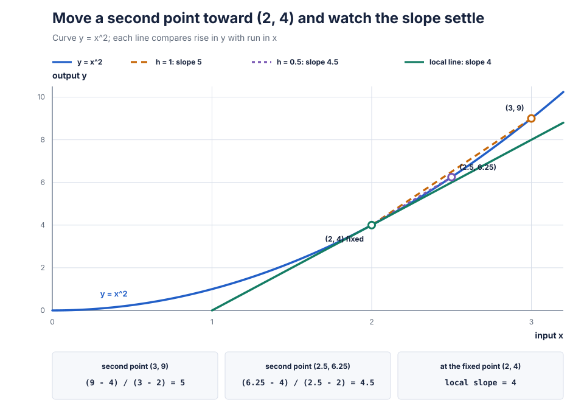

# Chapter 6: Backprop by Hand

Chapter 5 followed token ids all the way to one loss. That loss can
grade the model's next-token bets, but it cannot yet answer the
training question:

```text
which stored number should move, in which direction, and how much?
```

Chapter 0's loss fell because training used those answers to move the
stored numbers. The demo made the movement visible but left the
arithmetic hidden.

One loss sits at the end of a long calculation. Every learned weight,
gain, bias, and table entry sits somewhere earlier. We need to carry
the loss's response back through each operation without a framework
remembering the route or doing the arithmetic for us.

This chapter builds that return trip from arithmetic. First one input
moves one output. Then a change crosses two operations. Then two paths
meet. Only after those pieces work will they receive their calculus
and machine-learning names.

## Build a local rate from a nudge

Start with a rule whose behavior does not depend on where you stand:

```text
y = 3*x + 1
```

At `x = 2`, the output is `7`. Raise `x` by `0.1` and predict the new
output before reading on:

```text
old: y = 3*2.0 + 1 = 7.0
new: y = 3*2.1 + 1 = 7.3
```

The input moved by `0.1`; the output moved by `0.3`. Divide output
change by input change:

```text
output change / input change = 0.3 / 0.1 = 3
```

Try the same calculation at `x = 10`. A `0.1` input change still
moves the output by `0.3`. The rate is three everywhere because the
rule is a straight line.

Now use a rule whose rate changes:

```text
y = x*x
```

At `x = 2`, the output is `4`. A nudge of `1` gives `x = 3` and
`y = 9`, so the output change per unit input change is `5`. That rate
does not describe a much smaller move:

```text
nudge h    new output    output change    change / h
   1.00       9.0000          5.0000          5.00
   0.10       4.4100          0.4100          4.10
   0.01       4.0401          0.0401          4.01
```

Before revealing the limiting rate, predict whether the last column
is heading toward `4` or `5`.

The arithmetic exposes what remains as the nudge shrinks:

```text
(2 + h)^2 - 2^2

= (4 + 4*h + h^2) - 4

= 4*h + h^2
```

Divide by the input change `h`:

```text
(4*h + h^2) / h = 4 + h
```

As `h` shrinks toward zero, the extra `h` shrinks with it. The local
rate at `x = 2` approaches `4`.

This local output change per unit input change is a **derivative**, also
called a local **slope**. Give the rule `y = x*x` the short name `f`.
Two common spellings are

```text
f'(2) = 4
```

and

```text
dy/dx = 4
```

The prime mark in `f'(2)` asks for `f`'s local slope at input `2`.
The fraction-like spelling `dy/dx` asks for the local change in `y`
per change in `x`. Both say: near `x = 2`, a small change in `x`
produces about four times that change in `y`. The rate is local. At
`x = 3`, repeat the expansion with `(3+h)^2` and the surviving rate
is `6`.



Source: exact deterministic calculations in
[`scripts/figures/06_local_slope.py`](../scripts/figures/06_local_slope.py).

Sign carries direction. Predict the slope of `x*x` at `x = -2`.
Moving from `-2.00` to `-1.99` lowers the square, so the slope must be
negative. Expanding `(-2+h)^2` leaves a rate approaching `-4`.

A positive slope says both numbers move in the same direction. A
negative slope says they move in opposite directions. A zero slope
says there is no first-order response at that point. For `x*x` at
`x = 0`, a nudge still changes the output by `h^2`, but change per
unit nudge is `h^2/h = h`, which approaches zero.

## Carry one change through the next

The model rarely sends one value straight to the loss. Values pass
through operation after operation. Use two small ones:

```text
x = 2
y = 3*x = 6
L = y*y = 36
```

`L` stands for the final loss. We already know both local slopes:

```text
y changes 3 units per unit of x
L changes 2*y = 12 units per unit of y, at y = 6
```

Predict how fast `L` changes per unit of `x`. A change in `x` is
multiplied by `3` on its way to `y`, then by `12` on its way to `L`:

```text
loss slope with respect to x = 12 * 3 = 36
```

The direct equation agrees:

```text
L = (3*x)^2
  = 9*x^2

at x = 2, slope = 9 * 4 = 36
```

A `0.01` nudge provides a numeric check:

```text
x                  2.00        2.01
y                  6.00        6.03
L                 36.00       36.3609
loss change / 0.01           = 36.09
```

The measured rate is not exactly `36` because the nudge is not zero.
As the nudge shrinks, the extra part shrinks and the rate approaches
`36`.

Multiplying local slopes along a dependent path is the **chain rule**.
For the path above:

```text
x -------> y -------> L
    * 3        * 12

returning loss slope: 1 * 12 * 3 = 36
```

The loss begins with a slope of `1` with respect to itself: increasing
`L` by one increases `L` by one. Reading right to left, each operation
multiplies the arriving loss slope by its own local slope.

The source writes the question "how fast does the final loss change
with this value?" using a `d_` prefix:

```text
d_y = loss slope with respect to y
d_x = loss slope with respect to x
```

For a scalar operation `y = f(x)`, this path contributes

```text
d_x from this path = d_y * local_slope_of_f_at_x
```

First notice two chain-rule edge cases. If one local slope is zero,
this path returns zero. If one local slope is negative and the other
positive, predict the sign of their product: the returned slope is
negative.

## One loss has many slopes

One operation can have more than one input. Let

```text
L = 2*a - b
```

Hold `b` fixed and raise `a` by `0.1`. The loss rises by `0.2`, so the
loss slope with respect to `a` is `2`. Hold `a` fixed and raise `b` by
`0.1`. The loss falls by `0.1`, so the slope with respect to `b` is
`-1`.

When a rule has several inputs, a slope measured with one input while
the others stay fixed is a **partial derivative**. The curled symbol
`∂` marks that question:

```text
∂L/∂a =  2
∂L/∂b = -1
```

Collect the two answers in the same order as `[a, b]`:

```text
[ 2, -1 ]
```

This shaped collection of the loss's partial derivatives is a
**gradient**. A vector receives a vector of slopes. A matrix receives a
matrix of slopes in the same shape. The source therefore pairs `x`
with `d_x`, `weights` with `d_weights`, and every learned table with a
same-shaped gradient table.

A derivative is one local rate. A gradient is the collection of loss
rates for all entries of one shaped value.

Chapter 8 will use these signs and sizes to update learned values. This
chapter stops at calculating them.

## Add every returning path

One value may feed more than one later calculation:

```text
                 +-> a = 2*x -+
                 |            |
x = 2 -----------+            +-> L = a + b
                 |            |
                 +-> b = 3*x -+
```

Forward gives `a = 4`, `b = 6`, and `L = 10`. Nudge `x` by `0.1`.
The `a` path raises the loss by `0.2`; the `b` path raises it by
`0.3`. Predict the combined loss change:

```text
0.2 + 0.3 = 0.5
```

Per unit of `x`, the two returning slopes are

```text
from a: 1 * 2 = 2
from b: 1 * 3 = 3
total:          5
```

Writing `d_x = 2` for the first path and then `d_x = 3` for the second
would erase a valid contribution. The destination must add:

```text
d_x starts at 0
d_x += 2       gives 2
d_x += 3       gives 5
```

Adding every returning contribution when paths meet is **gradient
accumulation**. The addition is not an implementation detail around
the calculus. It is the forked calculation written as C.

The one-path calculation can now use the source's accumulating
spelling:

```text
d_x += d_y * local_slope_of_f_at_x
```

We have now built the whole mechanism:

1. start at the scalar loss with slope `1`;
2. visit the saved forward operations in reverse order;
3. multiply by each operation's local slopes;
4. add where several paths return to one value.

This practice is **backpropagation**, shortened to **backprop**, and
the traversal is the **backward pass**. Backpropagation has a fearsome
reputation and a boring definition: it is the chain rule, applied in
reverse order, with bookkeeping.

There is no automatic operation history in `Mat`. Chapter 4 showed
that it stores an address and two dimensions. Tiny AgenC knows its
fixed forward list, so `ops.c` contains one handwritten backward
function for every forward function. Chapters 11 and 12 later wire
those pieces across the complete model.

## A method you can reuse

Every backward function can be designed with the same four questions:

1. What equation did forward compute?
2. Which loss gradient arrives from the operation's output?
3. What local slope connects that output to each input?
4. Does each destination collect shared contributions or hold private
   scratch with one producer?

The first question determines which forward values backward must read.
The second supplies `d_out`. The third gives the multiplication. The
fourth chooses `+=` or `=`.

Two source conventions follow.

**Public gradients accumulate.** Input gradients and learned-value
gradients may receive another contribution before or after this
function. Their writes use `+=`. The caller zeroes these buffers once
before one complete backward pass. Calling a backward function twice
without clearing its public destinations adds its contribution twice.

**Private scratch may overwrite.** A temporary buffer with one producer
and no earlier contribution can use `=`. Attention's `d_scores` is the
one example in this chapter.

Backward signatures put gradient destinations first:

```text
matmul_forward(out, x, weights)
matmul_backward(d_x, d_weights, d_out, x, weights)
```

The shapes mirror forward. Backward also needs values saved by the
matching forward call. Old probabilities with new targets, or old
layernorm summaries with new inputs, describe a calculation that never
happened.

With the method established, we can unwind every operation from
Chapter 5.

## Send the bet-sheet grade back to logits

The last forward operation returned one scalar loss. Its backward
function has no `d_loss` argument because the starting slope is
already `1`.

A naive attempt might send `-1` to the target logit and zero to every
other logit. That catches the explicit target score in the loss, but
misses the shared softmax denominator. Raising any logit changes that
denominator and therefore changes the target's probability.

Chapter 2 built [`exp` and
`log`](02-foundations.md#growth-and-its-undo). We need their local
slopes before following this path.

For the exponential,

```text
exp(x + h) = exp(x) * exp(h)
```

Near zero, the change in `exp(h)` per unit `h` approaches `1`. For
example:

```text
h          exp(h)        (exp(h) - 1) / h
0.1000     1.105170918           1.051709
0.0100     1.010050167           1.005017
0.0010     1.001000500           1.000500
```

The surviving scale is therefore `exp(x)`:

```text
(exp(x + h) - exp(x)) / h

= exp(x) * (exp(h) - 1) / h

-> exp(x) * 1
```

This local rule is the **exponential derivative**:

```text
slope of exp(x) = exp(x)
```

Check it at `x = 1`, where `exp(1)` is about `2.718282`. With
`h = 0.01`, `exp(1.01)` is about `2.745601`, so

```text
(2.745601 - 2.718282) / 0.01 = about 2.7319
```

Predict what happens with a smaller nudge: the measured rate moves
toward `2.718282`, the current value of `exp(1)`.

Now nudge the logarithm at `x = 2`, where `log(2)` is about
`0.693147181`:

```text
h        log(2 + h)     (log(2 + h) - log(2)) / h
0.010     0.698134722                  0.498754
0.001     0.693647056                  0.499875
```

Predict the limiting rate: the last column is approaching `0.5`.
The inverse relationship explains that number. The logarithm undoes
the exponential:

```text
exp(log(x)) = x
```

The chain rule says the two local slopes multiply to `1`. The
exponential's slope at `log(x)` is `exp(log(x)) = x`, so the
logarithm's slope must be

```text
slope of log(x) = 1/x, for x > 0
```

This local rule is the **logarithm derivative**. Its positive-input
condition matches Chapter 2's definition of `log`.

Now write one row's mathematical loss in the unshifted form. Chapter
5's maximum shift changes the safe numerical route, not this function:

```text
Z   = Σ exp(logit[j])
loss_for_row = log(Z) - logit[target]
```

Pick any column `c`. Its path through `log(Z)` has local slopes

```text
logit[c] -> exp(logit[c]) -> Z -> log(Z)

exp(logit[c]) * 1 * (1/Z)

= exp(logit[c]) / Z

= probability[c]
```

The target column has a second path through
`-logit[target]`, with slope `-1`. Therefore:

```text
target column:       probability[c] - 1
every other column:  probability[c]
```

The source turns the target condition into a number named `indicator`:
`1` at the target column and `0` elsewhere. The complete row rule is

```text
d_logit[c] += probability[c] - indicator[c]
```

Tiny AgenC returns the mean loss across `R` flattened rows, not their
sum. Every row's contribution must therefore be divided by `R`.

Use two three-choice rows:

```text
row  probabilities       target
 0   [0.2, 0.3, 0.5]       2
 1   [0.6, 0.1, 0.3]       0
```

Before dividing by two, subtract `1` at each target:

```text
row 0: [ 0.2,  0.3, -0.5]
row 1: [-0.4,  0.1,  0.3]
```

Predict each row's sum. Both sum to zero. Adding the same amount to
every logit changes no softmax probability, so the loss has zero slope
in that shared-offset direction.

Now apply the mean scale:

```text
d_logits row 0 = [ 0.10, 0.15, -0.25]
d_logits row 1 = [-0.20, 0.05,  0.15]
```

The signs answer a local thought experiment. Moving the target logit
up, and each non-target logit down, would lower this loss if the logits
could move independently. Chapter 8 updates shared parameters rather
than logits directly, so one parameter step need not move every logit
in those separate directions.

Here is the complete implementation:

```c
void crossentropy_backward(Mat d_logits, Mat probs, const int *targets)
{
    float mean_scale = 1.0f / (float)probs.rows;

    for (int row = 0; row < probs.rows; row++) {
        const float *prob     = mat_row(probs, row);
        float       *d_logit  = mat_row(d_logits, row);

        for (int c = 0; c < probs.cols; c++) {
            float indicator = (c == targets[row]) ? 1.0f : 0.0f;

            d_logit[c] += (prob[c] - indicator) * mean_scale;
        }
    }
}
```

`mean_scale` records that forward averaged rows. The outer loop selects
matching probability and gradient rows. The conditional expression,
first met in [Chapter
2](02-foundations.md#fixed-integers-and-a-clock-that-does-not-turn-back),
produces the numeric answer key. The final line subtracts that key,
scales for the mean, and accumulates.

Backward reads the probabilities saved by
`crossentropy_forward`; it does not read logits or recompute softmax.
It also expects the same valid targets that forward checked.

There is no division by the target probability. If a finite logit's
stored target probability rounded down to zero in Chapter 5's float
softmax, the target contribution here is still about `-1/R`. That
matches the stable log-sum-exp loss. Nonfinite forward probabilities
remain outside the ordinary finite-input contract.

As a final check, predict the gradient for a one-row, already-certain
bet `[0, 1, 0]` whose target is the middle entry. Every contribution is
zero.

## Matmul sends contributions to inputs and weights

Forward matrix multiplication used every input entry with several
weight rows:

```text
out[r, o] = Σ over k of x[r, k] * weights[o, k]
```

Copying `d_out` into `d_x` cannot work: the shapes may differ, and the
weights determine how strongly each input affected each output.
Likewise, a weight served every input row, so its gradient must collect
from all rows.

Use two input channels and two output channels:

```text
X = [ 2  -1 ]       W = [  3  4 ]
    [ 1   3 ]           [ -2  1 ]
```

Forward gives

```text
out = [ 2*3 + -1*4     2*(-2) + -1*1 ]
      [ 1*3 +  3*4     1*(-2) +  3*1 ]

    = [ 2  -5 ]
      [15   1 ]
```

Suppose the arriving loss gradient is

```text
d_out = [ 5  -3 ]
        [ 2   4 ]
```

Start with input row 0. Its first output sends back `5` times weight
row 0. Its second output sends back `-3` times weight row 1:

```text
d_x row 0
    = 5*[3, 4] + -3*[-2, 1]
    = [15, 20] + [6, -3]
    = [21, 17]
```

Predict `d_x` row 1 before revealing it:

```text
d_x row 1
    = 2*[3, 4] + 4*[-2, 1]
    = [6, 8] + [-8, 4]
    = [-2, 12]
```

Weights collect in the other direction. Weight row 0 served output
column 0 for both input rows:

```text
d_weights row 0
    = 5*[2, -1] + 2*[1, 3]
    = [10, -5] + [2, 6]
    = [12, 1]
```

Predict the second weight row:

```text
d_weights row 1
    = -3*[2, -1] + 4*[1, 3]
    = [-6, 3] + [4, 12]
    = [-2, 15]
```

The numeric construction earns the general formulas:

```text
d_x[r, k]
    += Σ over o of d_out[r, o] * weights[o, k]

d_weights[o, k]
    += Σ over r of d_out[r, o] * x[r, k]
```

Forward multiplied an input by a weight. Backward sends the arriving
gradient to each side multiplied by the other side. The sums collect
all uses of that entry.

Here is the complete source:

```c
void matmul_backward(Mat d_x, Mat d_weights, Mat d_out, Mat x, Mat weights)
{
    /* d_x[r] += sum_o d_out[r][o] * weights[o]: rows are independent. */
    #pragma omp parallel for if(x.rows >= PARALLEL_THRESHOLD)
    for (int row = 0; row < x.rows; row++) {
        const float *d_output = mat_row(d_out, row);
        float       *d_input  = mat_row(d_x, row);

        for (int o = 0; o < weights.rows; o++)
            add_scaled(d_input, d_output[o], mat_row(weights, o), weights.cols);
    }

    /* d_weights[o] += sum_r d_out[r][o] * x[r]: output channels are
     * independent, so this loop parallelizes without collisions. */
    #pragma omp parallel for if(weights.rows >= PARALLEL_THRESHOLD)
    for (int o = 0; o < weights.rows; o++) {
        float *d_neuron = mat_row(d_weights, o);

        for (int row = 0; row < x.rows; row++) {
            const float *d_output = mat_row(d_out, row);

            add_scaled(d_neuron, d_output[o], mat_row(x, row), weights.cols);
        }
    }
}
```

The first loop assigns one complete `d_x` row to an iteration. For
each output channel, `add_scaled` adds the arriving scalar times the
corresponding weight row. Different outer iterations write different
rows.

The second loop assigns one complete `d_weights` row to an iteration.
Its inner loop walks every input row and adds that row's contribution.
Different output channels again write different rows.

Chapter 5 built [threads and data
races](05-forward-pass.md#make-every-output-from-one-input-row). These
two ownership choices make both OpenMP loops race-free. The order of
additions inside any one destination row stays fixed, so crossing the
parallel threshold does not reorder that row's float arithmetic.

For `x` shaped `R x I` and weights shaped `O x I`, the required shapes
are:

```text
d_out       R x O
d_x         R x I
d_weights   O x I
```

Unlike `matmul_forward`, this function does not repeat shape
assertions. Its caller must provide matching, non-overlapping storage
with valid capacities.

## Residual: the highway works in reverse

Forward residual addition was

```text
out = a + b
```

Nudge either input by one while holding the other fixed. The output
moves by one, so both local slopes are `1`. Sending the returning
gradient down only one input would discard the other valid route.

Use an arriving row and two destinations that already contain earlier
contributions:

```text
d_out       = [ 2, -3]
d_a before  = [10,  1]
d_b before  = [-4,  5]
```

Predict both rows after addition:

```text
d_a after = [12, -2]
d_b after = [-2,  2]
```

The source is the arithmetic:

```c
void residual_backward(Mat d_a, Mat d_b, Mat d_out)
{
    size_t count = mat_size(d_out);

    for (size_t i = 0; i < count; i++) {
        d_a.vals[i] += d_out.vals[i];
        d_b.vals[i] += d_out.vals[i];
    }
}
```

`count` covers every element of the arriving matrix. Each iteration
adds that element to both same-shaped destinations. Neither original
forward input nor the forward output is needed: addition's local slope
is always one.

The direct identity path sends an unchanged copy of the loss gradient
toward earlier residual-stream states, while the learned branch sends
another contribution through its operations. Highways run in both
directions.

## The GELU bend changes the returning slope

Passing `d_out` through unchanged would claim GELU has slope one
everywhere. Chapter 5's [GELU
curve](05-forward-pass.md#put-a-bend-between-widen-and-narrow) bends,
flattens on the negative side, and approaches a straight line on the
positive side. Its local slope must change with `x`.

The source formula multiplies changing pieces and contains `x^3`.
Build those two slope rules before using them.

Start with two factors that both use `x`:

```text
u = x
v = x + 1
y = u*v
```

At `x = 2`, the factors are `2` and `3`, so `y = 6`. Nudge `x` by
`0.1` and both factors move:

```text
new y = 2.1 * 3.1 = 6.51
change in y / 0.1 = 0.51 / 0.1 = 5.1
```

The `0.51` has three pieces:

```text
left factor's change:    0.1 * 3   = 0.30
right factor's change:   2 * 0.1   = 0.20
both changes together:   0.1 * 0.1 = 0.01
                                      ----
                                      0.51
```

After division by the common nudge, those pieces are `3`, `2`, and
`0.1`. Predict the measured rate for `h = 0.01`: it is `5.01`.
The last piece disappears as `h` shrinks, leaving `3 + 2 = 5`.

Now let the two factors have local rates `a` and `b`, so one small
input nudge changes them by about `a*h` and `b*h`:

```text
((u + a*h)(v + b*h) - u*v) / h

= (a*h*v + u*b*h + a*b*h^2) / h

= a*v + u*b + a*b*h

-> a*v + u*b
```

This two-path pattern is the **product rule**:

```text
slope of u*v = slope(u)*v + u*slope(v)
```

It is the same fork addition built earlier. One path changes the left
factor; the other changes the right.

Use the cubic at `x = 2` for the repeated-factor case. Its old value is
`8`. With `h = 0.1`, its new value is `2.1^3 = 9.261`, so the measured
rate is

```text
(9.261 - 8) / 0.1 = 12.61
```

Predict whether `h = 0.01` gives a rate closer to `12`. The new value
is `2.01^3 = 8.120601`, giving `12.0601`.

The symbols show where that limiting `12` comes from:

```text
(x + h)^3 - x^3

= x^3 + 3*x^2*h + 3*x*h^2 + h^3 - x^3

= 3*x^2*h + 3*x*h^2 + h^3
```

Divide by `h` and shrink it:

```text
3*x^2 + 3*x*h + h^2  ->  3*x^2
```

The same counting works when `x` is multiplied by itself any positive
whole number of times. A small change can enter through any one of
the `n` factors. Each of those `n` paths leaves `n-1` unchanged
factors, so each contributes `x^(n-1)`. Terms in which two or more
factors supply the small change shrink away faster.

This pattern is the positive-whole-number case of the **power rule**:

```text
slope of x^n = n*x^(n-1)
```

The `n = -1` reciprocal case needs its own construction. At `x = 2`,
the old value is `1/2 = 0.5`. Two nudges give

```text
h       1/(2 + h)    change / h
0.10      0.4761905     -0.238095
0.01      0.4975124     -0.248756
```

Predict the limiting rate from the signs and last digits: it approaches
`-0.25`. For any `x != 0`, the shrinking-nudge algebra is

```text
1/(x + h) - 1/x

= (x - (x + h)) / (x*(x + h))

= -h / (x*(x + h))
```

Divide by `h` and shrink it:

```text
-1 / (x*(x + h))  ->  -1/x^2
```

So the power rule also gives

```text
slope of x^(-1) = -x^(-2)
```

Division can now be read as multiplication by that reciprocal:

```text
a/b = a * b^(-1)
```

Before generalizing, let both parts move in

```text
q = x/(x + 1)
```

At `x = 1`, the numerator is `1`, the denominator is `2`, and
`q = 0.5`. Holding the denominator at `2`, the numerator path has rate
`1/2 = 0.5`. Holding the numerator at `1`, the denominator path uses
the reciprocal rate at `2`, so it contributes `-1/4 = -0.25`.
Predict their sum: `0.25`.

A `0.01` nudge checks it:

```text
new q = 1.01 / 2.01 = about 0.5024876
change / 0.01       = about 0.24876
```

Now let `a` and `b` be any two changing values. Apply the product,
reciprocal, and chain rules:

```text
slope of a/b

= slope(a) * (1/b)
  + a * (-1/b^2) * slope(b)

= (slope(a)*b - a*slope(b)) / b^2
```

This is the **quotient rule**. Chapter 5 used different phrases, the
[log product and quotient
identities](05-forward-pass.md#cross-entropy-keeping-score), for rules
about what `log` does to multiplication and division. The quotient
rule applies only where the denominator `b != 0`.

GELU also needs the slope of `tanh`. Chapter 5 built

```text
tanh(u) = (exp(2*u) - 1) / (exp(2*u) + 1)
```

Choose `u = log(3)/2` so `E = exp(2*u) = 3`. The numerator is `2`,
the denominator is `4`, and `tanh(u) = 0.5`. The exponential and chain
rules give `slope(E) = 2*E = 6`, so both numerator and denominator
have local rate `6`. Before revealing the result, predict its sign:
raising `u` must raise `tanh(u)`.

The quotient rule gives

```text
slope of tanh(u) = (6*4 - 2*6) / 4^2
                 = 12/16
                 = 0.75
```

That equals `1 - tanh(u)^2 = 1 - 0.5^2 = 0.75`.

Now leave `E = exp(2*u)` as a symbol. Its local rate is `2*E`.
Apply the same quotient arithmetic:

```text
slope of tanh(u)

= ((2*E)(E + 1) - (E - 1)(2*E)) / (E + 1)^2

= 2*E*((E + 1) - (E - 1)) / (E + 1)^2

= 4*E / (E + 1)^2
```

Now square the original fraction:

```text
1 - tanh(u)^2

= ((E + 1)^2 - (E - 1)^2) / (E + 1)^2

= 4*E / (E + 1)^2
```

The two results match:

```text
slope of tanh(u) = 1 - tanh(u)^2
```

This local rule is the **`tanh` derivative**.

These are all the calculus tools GELU needs. Write the exact
approximation from Chapter 5 as

```text
u = K * (x + A*x^3)
gelu(x) = 0.5*x*(1 + tanh(u))
```

where `K = sqrt(2/pi)` and `A = 0.044715`. The inside slope is

```text
du/dx = K * (1 + 3*A*x^2)
```

The product rule then gives

```text
gelu slope

= 0.5*(1 + tanh(u))
  + 0.5*x*(1 - tanh(u)^2)*(du/dx)
```

At `x = 0`, predict the result. `u = 0`, `tanh(0) = 0`, and the second
product path contains `x = 0`, so the exact slope is `0.5`.

Three source-equivalent evaluations are:

```text
x                 -1        0        1
GELU slope       -0.0830   0.5000   1.0830
d_out              2       -1        0.5
d_x added        -0.1659  -0.5000   0.5415
```

A small negative slope near `x = -1` and a slope slightly above one
near `x = 1` are expected behavior for this approximation.

Here is the complete backward function:

```c
void gelu_backward(Mat d_x, Mat d_out, Mat x)
{
    size_t count = mat_size(x);

    for (size_t i = 0; i < count; i++) {
        float value   = x.vals[i];
        float inner   = GELU_SQRT_2_OVER_PI * (value + GELU_CUBIC_COEFF * value * value * value);
        float tanh_of = tanhf(inner);
        float d_inner = GELU_SQRT_2_OVER_PI * (1.0f + 3.0f * GELU_CUBIC_COEFF * value * value);
        float slope   = 0.5f * (1.0f + tanh_of)
                      + 0.5f * value * (1.0f - tanh_of * tanh_of) * d_inner;

        d_x.vals[i] += slope * d_out.vals[i];
    }
}
```

`count` flattens the matrix because GELU treats each element
independently. `value`, `inner`, and `tanh_of` replay the forward
calculation. `d_inner` is the cubic inside slope. The two lines of
`slope` are the two product paths. The final line applies the chain
rule to `d_out` and accumulates into `d_x`.

The function saves no GELU output. It recomputes the needed local
values from `x`. For large negative finite inputs, the slope approaches
zero; for large positive inputs it approaches one. Extremely large
finite arithmetic can still overflow, and this kernel does not validate
nonfinite values.

## Layernorm couples every channel in a row

Layernorm is not an element-by-element operation. Chapter 5 built one
row's forward calculation:

```text
mean       = mean(x)
variance   = mean((x - mean)^2)
rstd       = 1 / sqrt(variance + epsilon)
norm       = (x - mean) * rstd
out        = gain * norm + bias
```

A naive backward attempt might use

```text
d_x = d_out * gain * rstd
```

That follows the direct path from one input to its matching output.
It misses two shared paths. Nudging one input changes the row mean,
which changes every centered value. It also changes the variance and
`rstd`, which rescales every normalized value.

Use Chapter 5's row with unit gain:

```text
x        = [1, 2, 3]
mean     = 2
variance = 2/3
rstd     = about 1.2247357
norm     = about [-1.2247357, 0, 1.2247357]
gain     = [1, 1, 1]
d_out    = [1, -1, 2]
```

The gain is one, so the gradient arriving at normalization is

```text
d_norm = d_out * gain = [1, -1, 2]
```

Its row mean is

```text
mean(d_norm) = (1 + -1 + 2) / 3
             = 2/3
```

Next multiply matching entries without summing:

```text
d_norm * norm

= [1 * -1.2247357,
   -1 * 0,
   2 * 1.2247357]

= about [-1.2247357, 0, 2.4494714]
```

This matching-entry multiplication is the **Hadamard product**, often
written with `⊙`. Unlike Chapter 5's dot product, it retains one output
per entry instead of summing them.

The second row mean is

```text
mean(d_norm ⊙ norm)
    = (-1.2247357 + 0 + 2.4494714) / 3
    = about 0.4082452
```

Now nudge only `x[0]` and separate its three routes. First freeze the
saved mean and `rstd`. The direct route changes `norm[0]` by
`rstd*h`. Since `d_norm[0] = 1`, its returning rate is

```text
direct route = 1 * 1.2247357 = 1.2247357
```

The mean does not stay frozen in the real operation. Raising one of
three inputs by `h` raises the mean by `h/3`, which subtracts `h/3`
from every centered entry. With `rstd` held fixed for this route, the
returning rate is

```text
centering route
    = (-rstd/3) * (1 + -1 + 2)
    = -1.2247357 * (2/3)
    = about -0.8164905
```

The remaining route changes the row's spread and therefore `rstd`.
Use `h = 0.001`. The nudged row and its new summaries are

```text
x              = [1.001, 2, 3]
mean           = 2.0003333
x - mean       = about [-0.9993333, -0.0003333, 0.9996667]
variance       = about 0.6660002
rstd           = about 1.2253483
```

The `rstd` change per unit nudge is

```text
(1.2253483 - 1.2247357) / 0.001 = about 0.6126
```

At `h = 0.0001`, the measured rate is about `0.6124`; it approaches
`0.6123587`. Isolate this rescaling route after the centered-value
routes above. The arriving row weights the original centered values by

```text
1*(-1) + -1*0 + 2*1 = 1
```

so the spread route contributes about `1 * 0.6123587`. Add all three
routes:

```text
d_x[0] = 1.2247357 - 0.8164905 + 0.6123587
       = about 1.0206039
```

Recomputing the complete normalized row at `h = 0.001` gives

```text
new norm = about [-1.2245314, -0.0004084, 1.2249399]

weighted normalized-output change / h
    = (1*( 0.0002043)
       + -1*(-0.0004084)
       + 2*( 0.0002042)) / 0.001
    = about 1.0211
```

The nonzero-nudge rate is close to `1.0206039` and approaches it as
the nudge shrinks.

The same three routes have a compact spelling for any channel:

```text
direct route     =  rstd * d_norm[c]
centering route  = -rstd * mean(d_norm)
spread route     = -rstd * norm[c] * mean(d_norm ⊙ norm)
```

For channel `0`, the spread spelling gives

```text
-1.2247357 * -1.2247357 * 0.4082452 = about 0.6123587
```

A positive centered input widens the row when raised, which lowers
`rstd`; a negative centered input narrows it, which raises `rstd`.
That opposite direction supplies the minus sign. Appendix A carries
the [full symbolic path
derivation](appendix-a-derivations.md#layernorm-backward-one-path-at-a-time).

Combining the three constructed routes gives the source formula:

```text
d_x[c] += rstd
          * (d_norm[c]
             - mean(d_norm)
             - norm[c] * mean(d_norm ⊙ norm))
```

Work channel 0:

```text
d_x[0]

= 1.2247357
   * (1 - 0.6666667 - (-1.2247357 * 0.4082452))

= about 1.0206
```

The full row is

```text
d_x = about [1.0206, -2.0412, 1.0206]
```

Predict its sum before checking:

```text
1.0206 - 2.0412 + 1.0206 = about 0
```

A shared offset added to every input is removed by the row mean, so
the loss cannot respond in that direction. Float rounding makes the
sum approximately zero.

Gain and bias have shorter paths:

```text
d_gain += d_out ⊙ norm
        = about [-1.2247, 0, 2.4495]

d_bias += d_out
        = [1, -1, 2]
```

The same gain and bias channels serve every row, so later rows add into
the same parameter destinations.

Here is the complete implementation:

```c
void layernorm_backward(Mat d_x, float *d_gain, float *d_bias, Mat d_out,
                        Mat x, const float *gain,
                        const float *means, const float *rstds)
{
    for (int row = 0; row < x.rows; row++) {
        const float *input    = mat_row(x, row);
        const float *d_output = mat_row(d_out, row);
        float       *d_input  = mat_row(d_x, row);
        float        mean     = means[row];
        float        rstd     = rstds[row];

        float d_norm_mean      = 0.0f;
        float d_norm_norm_mean = 0.0f;
        for (int c = 0; c < x.cols; c++) {
            float norm   = (input[c] - mean) * rstd;
            float d_norm = d_output[c] * gain[c];

            d_norm_mean      += d_norm;
            d_norm_norm_mean += d_norm * norm;
        }
        d_norm_mean      /= (float)x.cols;
        d_norm_norm_mean /= (float)x.cols;

        for (int c = 0; c < x.cols; c++) {
            float norm   = (input[c] - mean) * rstd;
            float d_norm = d_output[c] * gain[c];

            d_input[c] += rstd * (d_norm - d_norm_mean - norm * d_norm_norm_mean);
            d_gain[c]  += d_output[c] * norm;
            d_bias[c]  += d_output[c];
        }
    }
}
```

The outer loop selects one row and its saved `mean` and `rstd`. The
first channel loop reconstructs `norm` and `d_norm`, then accumulates
the two sums. Dividing by `x.cols` turns them into the two means used
in the numeric example.

The second channel loop reconstructs the same local values. Its first
write applies the compact input formula. The next two writes add the
gain and bias contributions.

The source keeps the row loop serial. Different rows own different
`d_x` rows, but they add into the same `d_gain[c]` and `d_bias[c]`.
Parallelizing rows without per-thread gain and bias totals followed by
a merge would create the data race Chapter 5 constructed.

Epsilon has not disappeared. It is already inside the exact saved
`rstd`. A constant row has

```text
rstd = 1/sqrt(0.00001) = about 316.2278
```

so the calculation remains finite for ordinary finite gradients.
With a zero gain in one channel, that channel sends no `d_norm` from
its own output path, but its `d_gain` can still be nonzero because the
normalized input may be nonzero.

## Attention unwinds the consultation

Attention's forward pass had three stages for each query:

```text
query and visible keys  -> scaled scores
scaled scores           -> softmax weights
weights and values      -> output mixture
```

Reversing only the final weighted sum would update values but leave
queries and keys untouched. Reversing only the scores would miss how
the output used values. The backward pass must visit all three stages
in the opposite order.

Before the complete example, build the coupled softmax step that sits
in the middle.

### A softmax row moves together

Suppose the two scores are `[0, log(3)]`. Exponentiating them produces
the unnormalized shares `[1, 3]`. Dividing by their total gives
probabilities

```text
p = [0.25, 0.75]
```

Increasing the first score changes its exponential share at its
current value, `1`. It also changes the total at rate `1`. Apply the
quotient rule:

```text
slope of p[0] with respect to score[0]
    = (1*4 - 1*1) / 4^2
    = 3/16
    = 0.1875

slope of p[1] with respect to score[0]
    = (0*4 - 3*1) / 4^2
    = -3/16
    = -0.1875
```

For the second score, its exponential changes at rate `3`:

```text
slope of p[0] with respect to score[1] = -0.1875
slope of p[1] with respect to score[1] =  0.1875
```

Arrange every output probability's slope against every input score:

```text
                         input score
                       0          1
output p[0]         0.1875    -0.1875
output p[1]        -0.1875     0.1875
```

This matrix of local partial derivatives is a **Jacobian**. The source
never allocates it. It only needs the result of sending one arriving
gradient row through it.

Let the arriving gradient with respect to the probabilities be

```text
d_weight = [2, -2]
```

Multiply through the columns:

```text
d_score[0] = 2*0.1875 + -2*(-0.1875) =  0.75
d_score[1] = 2*(-0.1875) + -2*0.1875 = -0.75
```

The same result collapses to one dot product:

```text
coupled = 0.25*2 + 0.75*(-2)
        = -1

d_score[0] = 0.25 * ( 2 - -1) =  0.75
d_score[1] = 0.75 * (-2 - -1) = -0.75
```

In general:

```text
coupled   = dot(weight, d_weight)
d_score[i] = weight[i] * (d_weight[i] - coupled)
```

Predict the sum of the two `d_score` entries. It is zero. Raising all
softmax input scores together changes no probabilities.

The private helper implements that collapse:

```c
static void softmax_backward_in_place(float *d_weights, const float *weights, int count)
{
    float coupled = dot(weights, d_weights, count);

    for (int i = 0; i < count; i++)
        d_weights[i] = weights[i] * (d_weights[i] - coupled);
}
```

`weights` holds the saved softmax probabilities. On entry,
`d_weights` holds the arriving gradient with respect to them. The dot
must use the complete incoming row before any entry is overwritten.
The loop then replaces that private scratch row with the gradient for
the scaled input scores.

Appendix A opens the [general softmax
derivation](appendix-a-derivations.md#softmax-backward-without-a-square-table).

### Unwind two causal positions

Recall [Chapter 1's no-peeking
rule](01-the-map.md#no-peeking-at-the-answer): position `t` may use
positions `0` through `t`, never a later position.

Reuse Chapter 5's [two-position
consultation](05-forward-pass.md#let-one-position-consult-the-visible-past):

```text
position    query      key        value
   0        [1, 0]    [1, 0]     [2, 1]
   1        [0, 1]    [0, 1]     [4, 3]
```

At position 0, the sole visible weight is `1`. At position 1, the
saved weights are

```text
[0.330238, 0.669762]
```

Let the arriving output gradients be

```text
d_out[0] = [1,  0]
d_out[1] = [1, -0.5]
```

Position 0 has one value choice. Its value receives

```text
d_value[0] += 1 * [1, 0] = [1, 0]
```

A one-element softmax always returns `[1]`, whatever its sole score.
Predict its score gradient: it is zero. Position 0 therefore sends no
query or key gradient through its score.

For position 1, unwind the weighted value sum first. Each weight's
local slope is its value dotted with `d_out[1]`:

```text
d_weight[0] = [2, 1] dot [1, -0.5] = 1.5
d_weight[1] = [4, 3] dot [1, -0.5] = 2.5
```

Each value receives the output gradient scaled by its saved weight:

```text
d_value[0] += 0.330238 * [1, -0.5]
            = [0.330238, -0.165119]

d_value[1] += 0.669762 * [1, -0.5]
            = [0.669762, -0.334881]
```

Position 0's value was used by both queries. Add both contributions:

```text
d_value[0] = [1.330238, -0.165119]
d_value[1] = [0.669762, -0.334881]
```

Now pass `d_weight` through softmax:

```text
coupled
    = 0.330238*1.5 + 0.669762*2.5
    = about 2.169762

d_scaled_score
    = about [-0.221181, 0.221181]
```

Predict their sum before moving on. The two entries cancel.

The head size is `2`, so the score scale is `1/sqrt(2)`, about
`0.7071068`. Backward through

```text
scaled_score = scale * dot(query, key)
```

adds one factor of `scale`:

```text
d_dot = scale * d_scaled_score
      = about [-0.156399, 0.156399]
```

The query collects each coefficient times its key:

```text
d_query[1]
    = -0.156399*[1, 0] + 0.156399*[0, 1]
    = [-0.156399, 0.156399]
```

Each key receives its coefficient times the query `[0, 1]`:

```text
d_key[0] = [0, -0.156399]
d_key[1] = [0,  0.156399]
```

These are contributions from query position 1. A longer sequence adds
later queries into the same earlier key and value rows. For any fixed
query position `t`, no later key or value position contributes because
the loops never visit `t2 > t`.

The complete backward helper uses the same three stages. First, the
new writable slice helper:

```c
static float *d_qkv_slice(Mat d_qkv, int row, int stream, int offset)
{
    return mat_row(d_qkv, row) + stream * (d_qkv.cols / QKV_STREAMS) + offset;
}
```

Chapter 5 walked the read-only
[`qkv_slice`](05-forward-pass.md#split-the-channels-into-separate-heads).
This twin performs the same pointer arithmetic but returns a writable
`float *` into the packed gradient row.

Here is one complete `(sequence, head)` backward:

```c
static void attention_head_backward(Mat d_qkv, Mat d_scores, Mat d_out,
                                    Mat qkv, Mat scores, int seq, int head,
                                    int time, int head_count)
{
    int   head_size = d_out.cols / head_count;
    int   offset    = head * head_size;
    float scale     = 1.0f / sqrtf((float)head_size);

    for (int t = 0; t < time; t++) {
        int          score_row = (seq * head_count + head) * time + t;
        const float *weights   = mat_row(scores, score_row);
        float       *d_weights = mat_row(d_scores, score_row);
        const float *d_output  = mat_row(d_out, seq * time + t) + offset;

        /* out = sum w[t2] v[t2], so each v earns w[t2] of the output
         * gradient and each w earns v . d_out. */
        for (int t2 = 0; t2 <= t; t2++) {
            d_weights[t2] = dot(d_output, qkv_slice(qkv, seq * time + t2, VALUES, offset), head_size);
            add_scaled(d_qkv_slice(d_qkv, seq * time + t2, VALUES, offset),
                       weights[t2], d_output, head_size);
        }

        softmax_backward_in_place(d_weights, weights, t + 1);

        /* raw[t2] = scale * (q . k[t2]) fans out to both sides. */
        const float *query   = qkv_slice(qkv, seq * time + t, QUERIES, offset);
        float       *d_query = d_qkv_slice(d_qkv, seq * time + t, QUERIES, offset);

        for (int t2 = 0; t2 <= t; t2++) {
            float d_raw = scale * d_weights[t2];

            add_scaled(d_query, d_raw, qkv_slice(qkv, seq * time + t2, KEYS, offset), head_size);
            add_scaled(d_qkv_slice(d_qkv, seq * time + t2, KEYS, offset),
                       d_raw, query, head_size);
        }
    }
}
```

The first three locals recover the head slice and forward scale.
Inside each query position, `score_row` locates that query's saved
softmax row. Despite the storage name `scores`, its visible entries
are weights after forward softmax. `d_weights` points into private
`d_scores` scratch.

The first `t2` loop implements the worked value stage. Assignment into
`d_weights[t2]` is safe because this scratch entry has one producer.
`add_scaled` uses `+=` for values because earlier values serve several
queries.

`softmax_backward_in_place` overwrites the visible scratch prefix with
`d_scaled_score`. In the final loop, the source local named `d_raw`
multiplies by `scale`; it is the coefficient on the unscaled dot
product, called `d_dot` in the worked example. The two `add_scaled`
calls send that coefficient to the query and key.

Future scratch cells after `t` remain untouched and meaningless. No
later code reads them.

The public wrapper is:

```c
void attention_backward(Mat d_qkv, Mat d_scores, Mat d_out, Mat qkv,
                        Mat scores, int time, int head_count)
{
    int sequence_count = d_out.rows / time;

    /* (seq, head) pairs touch disjoint slices of d_qkv, so the pair
     * loop parallelizes; the t loops inside share those slices. */
    #pragma omp parallel for collapse(2) if(sequence_count * head_count >= PARALLEL_THRESHOLD)
    for (int seq = 0; seq < sequence_count; seq++)
        for (int head = 0; head < head_count; head++)
            attention_head_backward(d_qkv, d_scores, d_out, qkv, scores,
                                    seq, head, time, head_count);
}
```

Dividing rows by `time` recovers the batch sequence count. Different
`(sequence, head)` pairs write disjoint channel slices, so OpenMP may
run them together. Query positions within one pair remain sequential:
they add into shared earlier keys and values. Parallelizing that inner
loop would create a data race.

The caller must supply positive `time` and `head_count`, complete
sequences, channels divisible by heads, and the same `qkv` and saved
weights produced by forward. This backward wrapper does not repeat
forward's assertions.

If a softmax weight rounds to exactly zero, its score gradient is
exactly zero in this float calculation. That is the backward edge of
the [saturation](05-forward-pass.md#turn-arbitrary-scores-into-usable-shares)
Chapter 5 plotted.

## Lookups return corrections to table rows

Embedding forward copied one token-table row and one position-table
row into each output row by addition. A naive backward assignment
would work only if every table row were selected once. Repeated token
ids and repeated positions would overwrite earlier contributions.

Use six flattened rows, three positions per sequence, and one channel:

```text
tokens = [0, 2, 1, 2, 0, 0]
time   = 3
d_out  = [1, 2, 3, 4, 5, 6]
```

Token id `0` appears at rows `0`, `4`, and `5`. Predict its table
gradient:

```text
d_token_table[0] += 1 + 5 + 6 = 12
```

The other token rows receive

```text
d_token_table[1] += 3
d_token_table[2] += 2 + 4 = 6
```

Positions restart for the second sequence because the source uses
`row % time`:

```text
position 0 receives rows 0 and 3: 1 + 4 = 5
position 1 receives rows 1 and 4: 2 + 5 = 7
position 2 receives rows 2 and 5: 3 + 6 = 9
```

The add-back behavior has now been constructed. Here is the complete
function:

```c
void embedding_backward(Mat d_token_table, Mat d_position_table, Mat d_out,
                        const int *tokens, int time)
{
    for (int row = 0; row < d_out.rows; row++) {
        const float *d_output = mat_row(d_out, row);

        add_scaled(mat_row(d_token_table, tokens[row]), 1.0f, d_output, d_out.cols);
        add_scaled(mat_row(d_position_table, row % time), 1.0f, d_output, d_out.cols);
    }
}
```

The loop selects one arriving row. The first `add_scaled` locates the
token row selected by forward. The second locates the position row.
A scale of `1` copies by addition, retaining every repeated use.

This loop is serial in the current source. Different input rows may
select the same token or position destination, so assigning them to
threads without coordination would race.

The same stored token table is also read as the final output matmul's
weights. Its matmul backward contribution and its embedding backward
contribution meet in one gradient table. [Chapter
9](09-parameters-and-the-blueprint.md) will build and name that shared
parameter arrangement. Here the rule is already sufficient: both
consumers use `+=`.

Embedding backward needs the ids and `time`; it does not need the
original table values or embedding output. Token ids and position
numbers select paths. They are integers, not float inputs receiving
gradients.

## The complete reverse ledger

Each backward operation now has an earned contract:

| Operation | Reads from forward | Arriving value | Adds into |
|---|---|---|---|
| cross-entropy | probabilities, targets | implicit scalar `1` | logits |
| matmul | input, weights | output gradient | input, weights |
| residual | no numeric forward value | output gradient | both inputs |
| GELU | input | output gradient | input |
| layernorm | input, gain, mean, rstd | output gradient | input, gain, bias |
| attention | QKV, saved weights | output gradient | packed QKV |
| embedding | token ids, time | output gradient | token and position tables |

Attention also overwrites the visible prefix of private `d_scores`
scratch. Every destination in the last column is public accumulation.

Saved values must describe the matching forward call. The individual
backward kernels trust their caller for shapes, valid ids, positive
dimensions, capacities, and separate storage. Chapter 11 later
constructs the [model-level latest-call
contract](11-wiring-the-model-forward.md#only-the-newest-forward-record-survives);
[Chapter
12](12-wiring-the-model-backward.md#walk-the-whole-model-in-source-order)
checks target-bearing eligibility and connects every gradient view.

The model-wide reverse order can now be read without undefined
machinery:

```text
loss
  |
  v
cross-entropy backward
  |
  v
tied output matmul backward
  |
  v
final layernorm backward
  |
  v
blocks from last to first
  |
  +-> residual after MLP
  |   down matmul -> GELU -> up matmul -> layernorm
  |
  +-> residual after attention
      projection matmul -> attention -> QKV matmul -> layernorm
  |
  v
embedding backward
```

The phrase "tied output" is a forward pointer to Chapter 9's
construction. The actual reverse wiring belongs to Chapter 12. This
chapter owns the arithmetic of each arrow.

Every backward function followed the same pattern:

```text
forward equation
  -> local slopes
  -> arriving gradient multiplied through
  -> contributions added into matching destinations
```

Vectors and matrices add indexes and sums, not a different chain rule.

## Backward truth needs an independent check

Every formula in this chapter was written by a fallible process: by
hand. A sign can flip, a scale can disappear, or one shared path can be
overwritten while the program still compiles and the loss still moves.

The supplied Chapter 6 lab uses an independent nudge-based check. It
runs the forward calculation around each input entry and compares the
observed loss response with the backward result. [Chapter
7](07-trust-but-verify.md) constructs that method, its tolerances, and
what its agreement does and does not prove.

The check covers ordinary finite fixtures. It does not license
invalid shapes, overlapping buffers, nonfinite inputs, or future
changes. Chapter 5's hand-calculated forward witnesses and Chapter 7's
measured backward witnesses watch different contracts.

## Build checkpoint: send gradients home

**Build.** Implement every public `_backward` twin in `ops.c`, plus
attention's private softmax helper. Work from the forward equation and
the numeric examples before copying a final formula. Zero external
gradient buffers once outside the kernels. Accumulate into inputs and
learned values; assign only to private scratch with one producer.

**Verify.**

```sh
make -C labs check-06
# answer key: make check-backward
```

Before running the command, predict which operation would fail if
`d_weights` used `=` inside its row loop. Then predict which repeated
embedding ids would expose the same mistake.

**Expected.** Every supplied backward comparison passes. Repeated
inputs collect every contribution, target logits include the mean-loss
scale, and the attention result respects the causal loop bound. The
command prints its exact current check count; this chapter does not
freeze that count without a committed evidence log.

**Common failures.**

- A gradient with the right magnitude and wrong direction has a sign
  error in one local slope.
- Correct single-path results but wrong shared results usually mean
  assignment replaced `+=`.
- Cross-entropy gradients too large by `R` forgot that forward returns
  a mean loss.
- Matmul failures grouped by output channel often indicate a
  transposed weight assumption or a missing input-row accumulation.
- GELU failures near zero often omit one product path; failures away
  from zero may omit the cubic or `tanh` slope.
- Layernorm input failures can come from dropping gain, the row-mean
  path, the spread path, or epsilon inside saved `rstd`.
- Attention score failures can come from overwriting scratch before
  the coupled dot, or applying the head-size scale zero or two times.
- Attention key or value errors at early positions often mean later
  queries did not accumulate into them.
- Letting attention visit `t2 > t` gives gradients to future positions
  that forward never read.
- Parallelizing query positions inside one head races on shared key and
  value destinations.
- Embedding assignment loses repeated token ids and repeated position
  rows.

---

[Previous: The Forward Pass](05-forward-pass.md) | [Contents](README.md) | [Next: Trust, but Verify](07-trust-but-verify.md)
