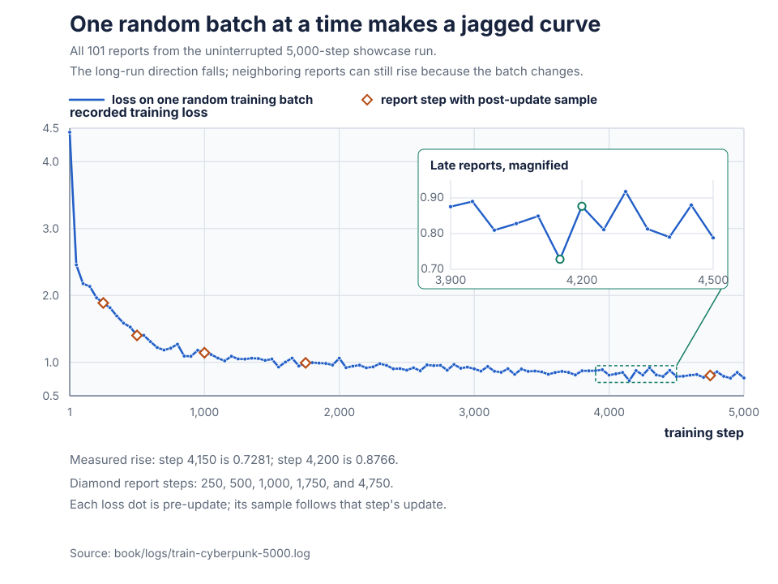
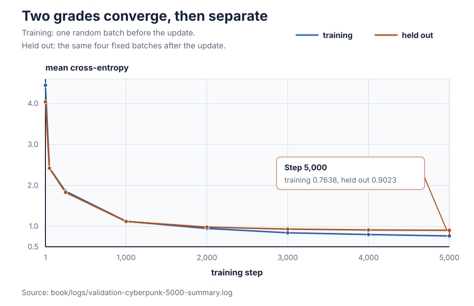

# Chapter 17: The Training Run

The machine can now adjust its parameters, save them, and turn its
scores back into text. A completed run leaves numbers and samples
behind. Those artifacts are evidence, but they are not conclusions by
themselves.

A falling training loss could mean that the update path is fitting the
text it receives. A recognizable sample could be one fortunate draw.
Neither observation says what happens on text kept away from updates.

**Predict:** which experiment can measure improvement on unseen
transmissions: one trained on every transmission, or one that keeps
some transmissions behind the no-peeking boundary?

## Two runs, two claims

Two runs do different jobs in this chapter.

```text
canonical clean corpus
        |
        +-> whole file -> showcase run
        |                 training trend, samples, timing
        |                 no held-out claim
        |
        +-> whole-record split
              |
              +-> training records -> parameter updates
              |
              +-> held-out records -> fixed grades, no updates
```

The first route is the original uninterrupted showcase in
[`train-cyberpunk-5000.log`](logs/train-cyberpunk-5000.log). It trains
on the whole corpus. Its complete log preserves 101 training reports,
20 progress samples, the command, hashes, machine, and elapsed time.
The resulting
[checkpoint](13-durable-checkpoints.md#chapter-13-durable-checkpoints),
Chapter 13's complete saved-model handoff, is the bundled
`tiny-agenc.bin`. This route shows the learner fitting update-eligible
text and makes its changing output visible. It has no untouched
transmissions from which to make a held-out claim.

The second route uses Chapter 3's
[whole-transmission split](03-data.md#keep-complete-scenes-out-of-training)
and Chapter 15's
[fixed held-out grades](15-the-training-loop.md#grade-without-sending-corrections-back).
It trains on 1,809 transmissions and keeps 202 away from updates. Its
selected reports, identities, and one replayed sample live in
[`validation-cyberpunk-5000-summary.log`](logs/validation-cyberpunk-5000-summary.log).
This route can measure whether lower loss crosses the split.

Keeping the runs separate preserves what each can honestly claim. The
whole-corpus samples do not become validation evidence, and the compact
validation summary does not become a complete timing log.

Before reading either run, the loss needs something to be compared
with.

## Loss needs a landmark

Chapter 5 constructed
[mean next-token loss](05-forward-pass.md#cross-entropy-keeping-score).
Lower is better, but a number such as `2.0` has little meaning by
itself.

Start with four possible next characters and no preference:

```text
number of choices          4
share on each choice       1/4
correct-answer penalty    -log(1/4)
                          = log(4)
                          = 1.3863
```

**Predict:** if the bet sheet grows from four equal choices to 80,
should the penalty rise or fall?

The correct answer receives a smaller share, so the penalty rises:

```text
number of choices         80
share on each choice      1/80
correct-answer penalty   -log(1/80)
                          = log(80)
                          = 4.382027
```

Every row receives the same penalty, so the mean is also `4.382027`.
This is the equal-bet calculation already checked in Chapter 5, now
used as a comparison point.

A rule graded on different target positions could receive an easier
question set. For a direct contest, the simpler and more capable rules
must answer the same target positions with the same loss calculation.
In Chapter 3's
[flashcard picture](03-data.md#one-extra-token-supplies-every-answer),
both answerers receive the same cards and the same grading rule.

A deliberately simpler prediction rule fixed before judging a more
capable rule is a **baseline**. The equal-bet rule is the **uniform
baseline**.

The baseline is not a floor. Randomly initialized logits need not be
equal, so one random batch can score above or below it. The showcase's
first training batch scores `4.4395`. That says its initialized bets
were not uniform on those targets. It does not say the learner is
broken.

Equal bets are an easy comparison to beat. The corpus supplies a
stronger rule that still fits on one small count sheet.

## Remember one previous character

Suppose the training text is:

```text
AABCA
```

Its vocabulary is `{A, B, C}`. Look only at positions where `A` has a
following character:

```text
observed pair       A -> A    A -> B    A -> C
count                  1         1         0
total after A                              2
naive share           1/2       1/2        0
```

This rule forgets everything before the final visible character. After
`A`, it consults the row of counts filed under `A`.
On each flashcard question, imagine covering every visible character
except the last one. That remaining character selects the count row.

**Predict:** what penalty does the naive rule receive when held-out
text contains the unseen pair `AC`?

It assigns the correct `C` a share of zero. Chapter 2's
[natural logarithm](02-foundations.md#growth-and-its-undo) accepts only
positive inputs, so `-log(0)` has no finite value. One missing pair can
ruin the entire mean.

The count sheet needs a way to leave every legal answer possible.

## Keep every answer possible

Put one provisional count on every line before adding the observations:

```text
next character             A         B         C
observed count             1         1         0
add one                    1         1         1
adjusted count             2         2         1
adjusted total       2 observed + 3 possible = 5
probability              2/5       2/5       1/5
decimal                  0.4       0.4       0.2
```

The probabilities still sum to one:

```text
2/5 + 2/5 + 1/5 = 5/5 = 1
```

The observed `A -> B` answer now receives

```text
-log(2/5) = -log(0.4) = 0.9163
```

The unseen `A -> C` answer remains more surprising, but it is finite:

```text
-log(1/5) = -log(0.2) = 1.6094
```

An ordered pair of adjacent tokens is a **bigram**. This predictor
counts which second byte followed each first byte in training. Adding
one provisional count to every legal outcome before normalizing is
**add-one smoothing**. Together they form the **add-one bigram
baseline**.

The repair has exact behavior at the edges. If a previous byte has no
recorded successor, every adjusted count is one and its row becomes
uniform. As observations accumulate, each provisional count matters
less. It never gives an unseen pair zero probability, but it also does
not look back two characters or recognize a word. Add-one smoothing is
a transparent comparison rule, not a claim that no stronger count
model exists.

## Walk the count model

The repository's evaluator is
[`tests/bigram.c`](../tests/bigram.c). It measures a fixed rule; it
does not change transformer parameters.

The count sheets travel in one record:

```c
typedef struct {
    unsigned long long pair[BYTE_VALUES][BYTE_VALUES];
    unsigned long long previous[BYTE_VALUES];
    int                seen[BYTE_VALUES];
    int                vocab_size;
} BigramCounts;
```

One small helper fills it from training text:

```c
static void count_training_bigrams(BigramCounts *counts, const char *train,
                                   size_t train_length)
{
    for (size_t i = 0; i < train_length; i++) {
        unsigned char byte = (unsigned char)train[i];

        if (counts->seen[byte])
            continue;
        counts->seen[byte] = 1;
        counts->vocab_size++;
    }
    for (size_t i = 0; i + NEXT_BYTE_OFFSET < train_length; i++) {
        unsigned char a = (unsigned char)train[i];
        unsigned char b =
            (unsigned char)train[i + NEXT_BYTE_OFFSET];

        counts->pair[a][b]++;
        counts->previous[a]++;
    }
}
```

The file sets `BYTE_VALUES` to 256 because one byte has 256 possible
bit patterns. `pair` is therefore a 256-by-256 array. Row `a`, column
`b` stores how often `b` followed `a`.
`previous[a]` stores the total number of recorded successors after
`a`. The caller's `{ 0 }` initializer starts every count and flag at
zero.

The first loop walks training bytes only. Chapter 3 introduced the
`unsigned char` cast that turns a possibly signed plain `char` into a
safe array index from 0 through 255. A seen byte takes the `continue`
guard back to the top. Only a new byte reaches `vocab_size++`.

`NEXT_BYTE_OFFSET` is one. The second loop stops while the next-byte
index remains inside the array, because the final byte has no next byte.
It reads one adjacent pair, increments that cell, and increments the row
total. No validation byte has entered either table.

The complete scoring helper applies the construction above:

```c
static double transition_loss(
    const unsigned long long pair[BYTE_VALUES][BYTE_VALUES],
    const unsigned long long previous[BYTE_VALUES],
    int vocab_size, unsigned char a, unsigned char b)
{
    double probability =
        ((double)pair[a][b] + ADD_ONE_PSEUDOCOUNT)
        / ((double)previous[a] + (double)vocab_size);

    return -log(probability);
}
```

`ADD_ONE_PSEUDOCOUNT` names the value `1.0`. The numerator converts the
observed pair count to `double`, then adds that provisional count. The
denominator converts the row total and adds one provisional count for
each of the `vocab_size` legal next bytes. Summing the
numerators for those seen vocabulary bytes therefore reproduces the
denominator.

The division produces the smoothed probability. The final line applies
the same natural-log penalty as the transformer loss. With this
repository's million-byte corpus, converting the integer counts to
`double` preserves their exact values before division.

The full-file grading helper is also built only from training counts:

```c
static LossMeasurement measure_full_validation(
    const BigramCounts *counts, const char *validation,
    size_t validation_length)
{
    double total_loss = 0.0;
    size_t predictions = 0;

    for (size_t i = 0; i + NEXT_BYTE_OFFSET < validation_length; i++) {
        unsigned char a = (unsigned char)validation[i];
        unsigned char b =
            (unsigned char)validation[i + NEXT_BYTE_OFFSET];

        if (!counts->seen[a] || !counts->seen[b])
            die("validation corpus contains a byte absent from training");

        total_loss += transition_loss(counts->pair, counts->previous,
                                      counts->vocab_size, a, b);
        predictions++;
    }

    if (predictions == 0)
        die("validation corpus has no next-byte predictions");
    LossMeasurement measurement = {
        .loss = total_loss / (double)predictions,
        .predictions = predictions,
    };

    return measurement;
}
```

Each loop iteration grades one adjacent validation pair. Validation
changes `total_loss` and `predictions`, never `pair` or `previous`.
A byte absent from the training vocabulary is rejected rather than
being granted an untrained output category.

The committed validation file has 106,701 bytes. Every byte except the
last has a successor, so this pass grades:

```text
106,701 - 1 = 106,700 prediction positions
```

The final division turns their accumulated penalties into one mean.
`predictions == 0` prevents that division from using zero as its
denominator. The helper returns both the mean and its denominator in a
`LossMeasurement`, so printing cannot accidentally pair a loss with a
different prediction count. The fixed-window helper below separately
checks that the file can supply 128 inputs and following answers and
that its draw bound fits in `int`.

## Reproduce the fixed questions

The transformer does not grade all 106,700 validation positions at
each report. Chapter 15 deals four fixed batches of 32 rows by 128
targets. A direct comparison needs the count model to answer those
same questions.

The evaluator first gives the shared policy short local names:

```c
enum {
    BYTE_VALUES = 256,
    VALIDATION_BATCHES = TINY_AGENC_VALIDATION_BATCHES,
    VALIDATION_BATCH_SIZE = TINY_AGENC_DEFAULT_BATCH_SIZE,
    VALIDATION_BLOCK_SIZE = TINY_AGENC_DEFAULT_BLOCK_SIZE,
    NEXT_BYTE_OFFSET = 1,
};

static const unsigned long long VALIDATION_SEED =
    TINY_AGENC_VALIDATION_SEED;
```

The first enum entry sizes the raw-byte tables. The next three entries
copy the shared batch count, row count, and row length. The final enum
entry names the one-byte distance between a question and its answer.
The declaration below the enum copies the shared seed into the type
accepted by `rng_new`.

This shortened excerpt reproduces the window draw:

```c
size_t last_start =
    validation_length - VALIDATION_BLOCK_SIZE - NEXT_BYTE_OFFSET;
Rng *rng = rng_new(VALIDATION_SEED);
LossMeasurement measurement = { 0 };

for (int batch = 0; batch < VALIDATION_BATCHES; batch++) {
    for (int row = 0; row < VALIDATION_BATCH_SIZE; row++) {
        size_t start = (size_t)rng_below(
            rng, (int)(last_start + NEXT_BYTE_OFFSET));

        measure_validation_window(counts, validation, start,
                                  &measurement);
    }
}
rng_free(rng);
measurement.loss /= (double)measurement.predictions;
```

`last_start` is the final index with 128 inputs and 128 following
answers available. Adding `NEXT_BYTE_OFFSET`, which is one, gives
`rng_below` the number of legal starts. Chapter 3 established that
these starts are
[sampled with replacement](03-data.md#draw-every-legal-start), so two
rows may grade the same position.

The loops preserve the transformer's outer order: four batches, then 32
rows. `measure_validation_window` owns the remaining 128-position loop:

```c
for (int time = 0; time < VALIDATION_BLOCK_SIZE; time++) {
    size_t at = start + (size_t)time;
    unsigned char previous = (unsigned char)validation[at];
    unsigned char next =
        (unsigned char)validation[at + NEXT_BYTE_OFFSET];

    measurement->loss +=
        transition_loss(counts->pair, counts->previous,
                        counts->vocab_size, previous, next);
    measurement->predictions++;
}
```

It reads the preceding byte and its known answer, applies the count
rule, and increments the number of graded slots. The final mean is
therefore weighted exactly like the four equal-sized transformer
batches.

Both executables include [`evaluation.h`](../src/evaluation.h), whose
shared comparison policy is:

```c
enum {
    TINY_AGENC_DEFAULT_BATCH_SIZE = 32,
    TINY_AGENC_DEFAULT_BLOCK_SIZE = 128,
    TINY_AGENC_VALIDATION_BATCHES = 4,
};

#define TINY_AGENC_DEFAULT_SEED           1337ULL
#define TINY_AGENC_SAMPLE_SEED_OFFSET        1ULL
#define TINY_AGENC_VALIDATION_SEED_OFFSET    2ULL
#define TINY_AGENC_VALIDATION_SEED \
    (TINY_AGENC_DEFAULT_SEED + TINY_AGENC_VALIDATION_SEED_OFFSET)
```

The bigram evaluator's `VALIDATION_SEED` is therefore:

```text
1,337 + 2 = 1,339
```

The number of graded fixed-window slots is:

```text
4 batches * 32 rows * 128 positions = 16,384 slots
```

They are slots, not necessarily 16,384 distinct corpus positions,
because starts are drawn with replacement.

This match belongs to the default recorded configuration. The training
program derives its validation seed from the user's `--seed`, while the
standalone bigram evaluator fixes the default `1,339`. Changing the
training seed, batch size, or block size makes `make bigram-baseline`
a different set of questions unless the evaluator is changed to match.

One unfamiliar output value remains to be constructed before running
that command.

## Turn loss back into an equal-choice count

Logarithms make products into sums, which lets Chapter 5 average
next-token penalties. The resulting scale is compact but not always
easy to picture.

Consider two correct-answer shares:

```text
first target share       1/2     penalty 0.6931
second target share      1/8     penalty 2.0794
mean penalty       (0.6931 + 2.0794) / 2
                   = 2.7725 / 2
                   = 1.3863
```

**Predict:** how many equal choices give the same `1.3863` penalty?

The four-choice calculation at the start of the chapter gave:

```text
-log(1/4) = log(4) = 1.3863
```

The two changing sheets therefore have the same mean penalty as one
sheet split equally among four choices.

For a mean loss `L`, reconstruct the equal sheet one operation at a
time:

```text
penalty on equal target share q     -log(q) = L
undo the leading minus                log(q) = -L
undo log                                  q = exp(-L)
equal number of choices                  N = 1/q
                                         N = exp(L)
```

The last line uses the Chapter 2 relation
`exp(-L) = 1 / exp(L)`.

The quantity `exp(L)` is **perplexity**: the number of equal-probability
choices that would receive the same mean natural-log loss. It can be a
fractional number because it is an equivalent scale, not a literal
count of choices at every position.

Lower loss always means lower perplexity. A perfect target share of one
has loss zero and perplexity `exp(0) = 1`. Perplexity does not make
mismatched experiments comparable. The tokenizer and target positions
must still agree. Within one calculation, the inverse operation must
match its logarithm; Tiny AgenC uses natural `log` and `exp`.

This shortened excerpt prints it by applying `exp` to each completed
mean:

```c
printf("bigram: uniform loss %.6f | full-file add-one loss %.6f | perplexity %.4f\n",
       log((double)counts->vocab_size), full.loss, exp(full.loss));
printf("bigram: fixed-window add-one loss %.6f | perplexity %.4f\n",
       fixed.loss, exp(fixed.loss));
```

`log((double)counts->vocab_size)` is the uniform loss. `exp(full.loss)`
and `exp(fixed.loss)` rescale the two bigram grades without changing
which is lower.

## Compare the same questions

Run the committed evaluator:

```sh
make bigram-baseline
```

Its exact recorded output is:

```text
bigram: vocab 80 | validation predictions 106700
bigram: uniform loss 4.382027 | full-file add-one loss 2.326050 | perplexity 10.2374
bigram: fixed-window seed 1339 | 4 x 32 x 128 = 16384 predictions
bigram: fixed-window add-one loss 2.320951 | perplexity 10.1854
```

The full-file and fixed-window values are close, but they do not grade
the same weighting of positions.

**Predict:** which bigram loss is the direct comparison for the
transformer's fixed validation reports: `2.326050` or `2.320951`?

The matched value is `2.320951` because both predictors answer the same
16,384 slots drawn in the same order. The broader full-file value
answers a useful but different question.

This rule prevents a subtle unfair comparison:

```text
same file, different weighting of positions     not a direct contest
same positions, same grading rule                matched contest
```

Beating `2.320951` means the complete transformer predictor receives a
lower grade than this specific add-one, one-byte-context rule on those
slots. It does not isolate attention, prove that all 128 visible
characters mattered, or rule out a stronger count model.

The comparison tools are now ready. The recorded runs can be read
without asking one number to answer every question.

## Read the full-corpus run

The recorded showcase fixed its build, data, configuration, and thread
environment:

```sh
make NATIVE=1 corpus
make NATIVE=1
mkdir -p build/evidence
env -u OMP_NUM_THREADS ./tiny-agenc train \
    --data data/cyberpunk.txt \
    --out build/evidence/full-run.bin \
    --steps 5000 --layers 4 --heads 4 --width 128 \
    --block 128 --batch 32 --lr 0.001 --seed 1337
sha256sum build/evidence/full-run.bin
```

`NATIVE=1` opts into the recorded host-tuned build. Removing an
inherited `OMP_NUM_THREADS` lets Tiny AgenC use the recorded 32-thread
default. The command's checkpoint SHA-256 is:

```text
b425ee5d0a2b09168114fa4fd7e755725fa63f4809b1cdb3034f9603b131863d
```

That checkpoint exactly matches the bundled `tiny-agenc.bin`. The log
also records the historical source and executable hashes, GCC 13.3.0,
the corpus hash, the 32-core machine, and wall time `4:16.77`.
[`EVIDENCE.md`](../EVIDENCE.md#recorded-build) keeps later
hardening replays separate from those historical timing claims.

The run banner records:

```text
tiny-agenc: 815360 parameters | 376.5 MiB buffers | vocab 80 | 4 layers x 4 heads x 128 wide
tiny-agenc: 1089394 tokens of training data from data/cyberpunk.txt
```

One step grades:

```text
32 rows * 128 positions = 4,096 target slots
```

**Predict:** how many target slots pass through the loss over 5,000
steps?

```text
5,000 * 4,096 = 20,480,000 presented target slots
```

They are not 20,480,000 distinct facts. Chapter 3's window starts are
sampled with replacement, separately drawn windows can overlap, and
neighboring targets within one window reuse most of the same context
bytes. The same corpus position can return many times.

The complete 101-report curve looks like this:



Each dot grades one newly drawn training batch before that step's
update. Consider three adjacent reports:

```text
step 700     loss 1.1842
step 750     loss 1.2121
step 800     loss 1.2709
```

**Predict:** did those two rises make the run inconsistent with an
overall downward trend?

No. The batches changed as well as the parameters. Across the complete
log, 42 adjacent report pairs rise. The lowest reported random-batch
loss is `0.7281` at step 4,150, while the final report is `0.7668`.
The endpoints still move from `4.4395` to `0.7668`.

That decline is evidence that the optimizer fitted update-eligible
NIGHT GRID targets. The scalar loss does not identify which operation
learned a speaker label, when a word became stable, or whether an
unseen transmission improved. Those need other observations.

## Progress samples change two things

The progress text supplies one such observation, but it is not a
controlled checkpoint comparison.

Chapter 15's ordering is:

```text
forward -> store loss -> backward -> update -> report -> sample
             ^ pre-update                    ^ post-update
```

The loss printed beside step 250 grades the model before update 250.
The sample labeled step 250 uses the model after update 250.

Chapter 16's
[writer seeding rule](16-sampling.md#seeding-the-writer) adds a second
difference. The progress RNG starts at `seed + 1`, or `1,338`, and
persists across reports:

```text
step 250 sample      first 200 draws from the progress RNG
step 500 sample      next 200 draws from the same RNG
step 750 sample      next 200 draws again
```

Every progress sample begins from a fresh hidden newline and uses
temperature `0.8`, but the draw stream does not restart. Between two
samples, both the parameter values and the RNG position change. Later
text can show a broad visual trend; one changed sentence cannot be
attributed to learning alone.

The recorded step-250 trace is word-shaped noise with fragments of
speaker labels:

```text
KRAZR: Weett too ad tad neet shar fre-ckeort. Stam lanndourene gon blo womertt ll theee te't shad beoout icth ror on and iner.
WIRAZR: Yeear s ount as ond the landenans thaser teach eme.
JINX: Sthefor
```

After update 500, a damaged transmission header appears:

```text
== TRANSMISSION 052 // SECTOR 11: BRESIICKS ===
GHOST: I gut lad exys the putadns. Dock on to stilled fret.
```

After update 1,000, speaker labels and short exchanges hold for longer,
while spelling and sentence structure remain unstable:

```text
GHOST: Keep your props don't be move, no caught a trouble in the Grid drofters are at their side and one cokerr.
DOC: Got a probble. or they when is detated move that.
GHOST: Just move?
```

After update 1,750, the trace contains a grammar-shaped header:

```text
=== TRANSMISSION 0512 // SECTOR 2: CORPORATE PARLANGE ===
RAZR: The might be ice wild about through the wauliting that stall sware.
```

The header is assembled from familiar local forms. One generated
string that does not appear verbatim in the corpus would rule out only
verbatim copying of that complete string. It would not establish broad
originality or held-out prediction.

The step-4,750 report is `0.8039`; the step-5,000 report is lower at
`0.7668`.

**Predict:** must the step-5,000 trace therefore look better?

The two traces answer different random choices, and training loss
grades known corpus answers rather than prose quality. The recorded
step-4,750 trace is:

```text
=== TRANSMISSION 0568 // SECTOR 9: CORPORATE LOBBY ===
JINX: Blackout incoming? Can't fight be or nothing for good.
JINX: What's happening for a transfer tonight?
DOC: Will turn into trust an option.
```

The final trace is:

```text
DOC: who knows what it work if we have to fallow.
WIRES: all set to our play. or we're nothing getting with more chrome to the vault as good around.
GHOST: let's move this like a neon glitch. tomorrow
```

A reader may prefer the earlier draw. That does not reverse the measured
loss trend, and the lower final batch loss does not certify the final
sample. The complete log supports a noisy visual progression toward
recurring words, speaker labels, and document layout. It does not
support a monotonic sample-quality scale.

## Read the held-out run

The second run used the exact recorded split and command:

```sh
make NATIVE=1 validation-data
env -u OMP_NUM_THREADS ./tiny-agenc train \
    --data data/cyberpunk.train.txt \
    --val-data data/cyberpunk.val.txt \
    --out build/evidence/validation-run.bin \
    --steps 5000 --layers 4 --heads 4 --width 128 \
    --block 128 --batch 32 --lr 0.001 --seed 1337
sha256sum build/evidence/validation-run.bin
```

The splitter shuffles complete transmissions with PCG32 seed `1,337`,
then assigns 90 percent to training and 10 percent to validation:

| Role | Transmissions | Bytes | May update parameters? |
|---|---:|---:|---|
| training | 1,809 | 982,693 | yes |
| validation | 202 | 106,701 | no |

One 80-entry tokenizer is built from training data and then encodes the
validation file. Validation is rejected if it contains a byte absent
from that training vocabulary. The exact split and checkpoint hashes
are recorded in the linked summary and `EVIDENCE.md`.

The validation checkpoint SHA-256 is:

```text
0753089369482f5ac9e4cb80c940c90b58f38493019ddcc4478ced61242350b8
```

It is a recorded result, not a bundled artifact.

At every selected report, the two columns have the distinction Chapter
15 constructed under
[training loss is not a report card](15-the-training-loop.md#training-loss-is-not-a-report-card):

```text
loss     one random training batch, before this step's update
val      four fixed held-out batches, after this step's update
```

The values on one line therefore straddle one update and grade
different collections of targets. Step 1 does not compare the
initialized model on both sides: its `loss` is pre-update, while its
`val` is post-update.

The committed summary retains these eight selected reports:

| Step | Random training batch | Fixed held-out batches |
|---:|---:|---:|
| 1 | 4.4463 | 4.0430 |
| 50 | 2.4230 | 2.4210 |
| 250 | 1.8567 | 1.8301 |
| 1,000 | 1.1218 | 1.1182 |
| 2,000 | 0.9470 | 0.9790 |
| 3,000 | 0.8414 | 0.9320 |
| 4,000 | 0.7987 | 0.9105 |
| 5,000 | 0.7638 | 0.9023 |



The plotted segments connect selected reports. The compact summary is
not the complete 101-report validation stream, so it cannot support
claims about omitted points.

At step 50, fixed held-out transformer loss is `2.4210`. At step 250,
it is `1.8301`.

**Predict:** which is the first selected report below the matched
bigram value `2.320951`?

```text
step 50       2.4210 > 2.320951
step 250      1.8301 < 2.320951
```

Step 250 is the first retained report that beats this specific
add-one bigram on the same fixed slots. The crossing happened sometime
after the step-50 state and no later than the step-250 state; the
selected records do not locate it more precisely.

At step 1,000 the printed values are close. By step 5,000 their
distance is wider. Before naming that pattern, inspect the held-out
column alone:

```text
4.0430 -> 2.4210 -> 1.8301 -> 1.1182
       -> 0.9790 -> 0.9320 -> 0.9105 -> 0.9023
```

**Predict:** does this selected sequence satisfy Chapter 15's
[overfitting pattern](15-the-training-loop.md#when-the-two-grades-part-company),
where training improves while held-out loss stalls or rises?

No. Every retained held-out value falls. The reports show continued
[generalization](15-the-training-loop.md#when-the-two-grades-part-company)
to these fixed windows, while later selected training-batch
improvements transfer less fully. They do not witness overfitting, and
they do not choose one correct stopping step.

Four fixed batches make report-to-report comparisons stable. They
still cover only 16,384 sampled slots from a 106,700-position
validation file. A full-file transformer evaluation or a broader set
of resampled windows would be another measurement.

## One generated sample is one trace

The held-out run's final checkpoint was replayed with:

```sh
./tiny-agenc sample \
    --model build/evidence/validation-run.bin \
    --prompt "=== TRANSMISSION 0999 // SECTOR 9: " \
    --length 199 --temperature 0.8 --seed 1337
```

It began:

```text
=== TRANSMISSION 0999 // SECTOR 9: MERCANPAY SHOWEPY ===
NYX: "Grid's down, RAZR. MIRES in on gun. Stay frosty."
GHOST: "chrome is tightening stay frosty. We can't let up too clay."
RAZR: "We may have to black on the stall docks again
```

This is a corpus-shaped trace with recognizable layout, speaker names,
and recurring words. It starts a fresh standalone RNG at seed `1,337`;
it is not a continuation of the training progress stream at seed
`1,338`.

The sample has no known answer sheet. It is not the held-out evaluation
and cannot establish generalization by itself. The target-bearing
validation loss supplies that quantitative evidence; generated text
supplies a qualitative inspection of one path through Chapter 16's
sampling regions.

The summary retains the 35-byte visible prompt, all 199 generated
bytes, and the final presentation newline. Their 235-byte stdout
SHA-256 is:

```text
8d8e1d20f37e9a54ba908277251a8a9b61f4cac6920aa86abd2c9f33c0cd144e
```

Because the validation checkpoint is not bundled, the command above is
directly runnable only after reproducing that checkpoint. A new build
or platform may follow a different floating-point and sampling path.

## State what the experiment leaves unanswered

At this scale, with this corpus and a 128-character window, the traces
show locally recognizable NIGHT GRID form alongside fragile content.
The measured system has 815,360 parameters, byte tokens, and four
transformer blocks. Those facts bound the experiment.

It does not evaluate factual accuracy, instruction following,
assistant behavior, long-document recall, or another corpus. It also
does not isolate whether attention, the feed-forward path, positions,
or some combination produced the advantage over the add-one bigram.

More parameters, a longer context, or different data would create new
experiments. This run does not establish which change is necessary or
sufficient.

## Timings belong to one build

The showcase's `4:16.77` wall time covers the whole command. Its
reported steady-state training windows are mostly in the high 40s to
low 50s milliseconds per step. Chapter 15's
[timer boundary](15-the-training-loop.md#time-only-completed-learning-work)
stops before validation, printing, sampling, and checkpoint I/O, then
restarts afterward. Wall time and `ms/step` are different measurements.

Two engineering scars are kept for the tour. Both belong to the
recorded AMD Threadripper PRO 9975WX, GCC 13.3.0, build flags, and
workloads in [`dev-measurements.md`](logs/dev-measurements.md).

**Predict:** on the recorded 32-core, 64-logical-processor machine,
must 64 OpenMP threads train faster than 32?

The post-fast-math sweep measured:

| OpenMP threads | Milliseconds per step |
|---:|---:|
| 16 | 59.6 |
| 32 | 43.3 |
| 64 | 225.7 |

More threads were slower in that workload. The measurement does not
isolate one cause. Shared physical-core resources and time spent
starting and coordinating worker threads are both possible
contributors. Chapter 14's
[runtime policy](14-the-command-line.md#openmp-is-optional-not-invisible)
therefore uses half the reported logical processor count only when the
operator has not set `OMP_NUM_THREADS`. It is a measured default, not a
universal optimum.

A smaller pre-threshold workload made the overhead more visible:

```text
16 threads       4.7 ms/step
64 threads     191.7 ms/step
191.7 / 4.7     40.8 times slower
```

The source's `PARALLEL_THRESHOLD` now keeps small operations serial.
The recorded tiny-model sweep printed the same step-100 loss `2.5174`
at every tested thread count; that witness does not make timings
portable to another machine.

The second scar is floating-point compilation.

**Predict:** what speed factor separates `268.2` and `43.3`
milliseconds per step?

```text
268.2 / 43.3 = 6.19, about 6.2 times
```

That was the recorded 32-thread change after enabling `-ffast-math`.
The flag lets the compiler regroup additions, such as changing
`(a + b) + c` into `a + (b + c)`, and make other transformations that
can change float rounding and exact replay. The source-level model
formulas did not change, but bitwise floating-point behavior is not
promised.

`NATIVE=1` adds host-specific instruction selection to the historical
recipe. Plain `make` remains CPU-portable. Exact timings and last
digits stay attached to the recorded machine, compiler, flags, and
input identities.

## Know what the evidence check proves

`make check-evidence` is a replayable boundary around the committed
artifacts. It does not hide an eight-minute training job.

| It checks | It does not do |
|---|---|
| manifest hashes for pinned inputs and evidence | rerun either 5,000-step experiment |
| canonical cleaning and seeded record split | rerun the original stochastic corpus generator |
| exact add-one bigram output | claim a custom configuration is matched |
| bundled checkpoint identity and sample replay | bundle the held-out checkpoint |
| recorded metric and replay hashes in the logs | turn a recorded value into a portable threshold |

The manifest also pins this chapter's exact bytes. A prose revision
therefore receives a deliberate checksum review instead of silently
changing the interpretation attached to the measurements. Refreshing
that one prose checksum does not alter an experiment, data file, log,
checkpoint, or source identity.

## Build checkpoint: reproduce the evidence

### Build

Chapter 17 adds no learner operation. Build the fixed-batch witness and
the count comparator, then use the committed evidence check to connect
their outputs to the recorded runs. If your machine budget permits,
run the held-out command above and keep its command, hashes, compiler,
flags, and output together.

### Verify

```sh
make overfit
make bigram-baseline
make check-evidence
make check-all
```

### Expected

The fixed-batch witness finishes below `0.1` and below one tenth of its
initial loss. The bigram command prints full-file loss `2.326050`,
matched loss `2.320951`, and their recorded perplexities. The evidence
check confirms the pinned identities, derivations, bundled replay, and
selected recorded metrics.

In the recorded held-out experiment, the first retained transformer
report below the matched bigram is step 250. A shorter local run is not
promised to cross that comparison. Exact timings, checkpoint bytes,
and final floating-point digits remain properties of the recorded
build and platform.

### Common failures

- Comparing a full-file score with fixed-window reports changes the
  graded positions.
- Comparing perplexities from different tokenizers or target units
  gives the same name to different questions.
- Reading one generated sample as a metric confuses a random trace with
  known-answer grading.
- Calling every widening printed gap overfitting ignores whether the
  held-out grade stalled or rose.
- Assuming `make check-evidence` reruns training mistakes artifact
  verification for experiment reproduction.
- Calling a custom-seed transformer run matched to the fixed seed-1339
  bigram changes the validation windows.

The assembled machine now has an honest report card. Chapter 18 can
separate the mechanisms that carry into larger systems from the scale
and engineering that change.

---

[Previous: Sampling](16-sampling.md) | [Contents](README.md) | [Next: Epilogue](18-epilogue.md)
